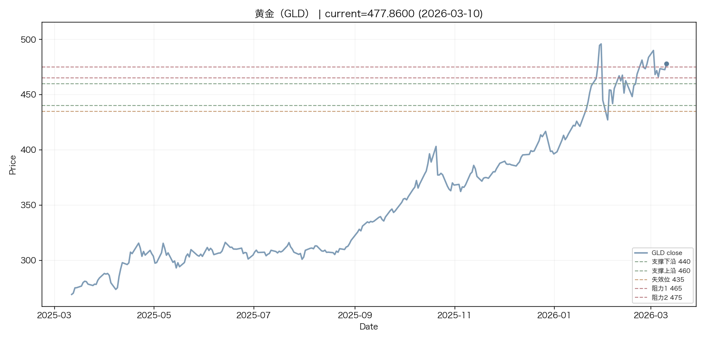
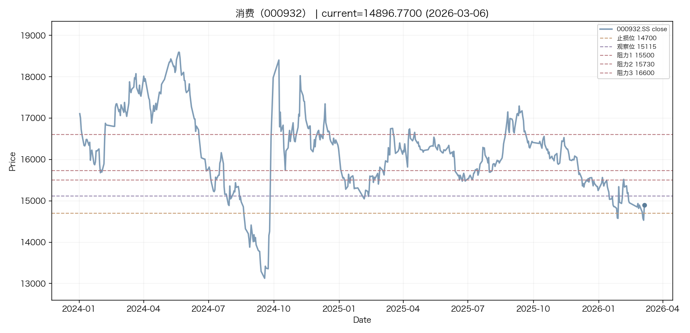

# 多资产投资报告生成器 Multi-Asset Investment Report Generator

[中文](#中文) | [English](#english)

---

## 中文

从微博账号「[量化榨汁机](https://weibo.com/u/6937480224)」的内容出发，通过 LLM 提取核心观点与关键点位，结合历史行情数据，自动生成包含技术图表的结构化多资产分析报告。

### 设计动机

量化榨汁机是一个高质量的多资产投资分析微博账号，覆盖黄金、美债、A股指数、油气等十几个品种，每天发布大量技术分析和操作建议。但微博的信息流形式有两个问题：一是碎片化，同一个品种的观点散落在不同时间的帖子里，难以纵览；二是缺少价格标注，作者提到的支撑位、阻力位需要自己对照 K 线图去理解。

这个工具把作者的内容系统化：LLM 提取每个品种的核心观点和关键价位，自动拉取行情数据生成带标注的技术图表，最终输出一份覆盖所有品种的结构化报告。从"刷微博碎片化阅读"变成"一张表看全局"。

### 设计迭代

核心功能早期就已经跑通，后续迭代主要花在报告格式和内容质量上：

- **品种交叉污染**：作者经常在讨论黄金的段落里顺带提到美元走势，LLM 会把美元的观点错误归到黄金名下。最终通过 TOKEN_ALIASES 别名表 + 交叉污染评分机制解决，每段文本同时计算所有品种的匹配度，取最高分的归属
- **图表标注线的可读性**：支撑位/阻力位的标注线经常和 K 线重叠导致看不清，多次调整了颜色、虚线样式、标签位置，还加了股票拆分/合并的价格回溯修正
- **原文摘录的排版**：微博原文是连续的长段文字，直接塞进报告里很难读。加了按日期分段、过渡语过滤、句子级分块等处理
- **图片布局**：源文档里的截图有横版有竖版，尺寸差异大，在报告里并排显示时经常错位。最终实现了自动检测图片方向并调整宽度的逻辑
- **长尾品种处理**：作者偶尔提到的非常规品种，最初靠规则匹配经常漏掉。后来改用 LLM 做品种识别和验证，自动发现未覆盖的品种并生成未覆盖清单
- **方法论提炼**：作者的交易体系散落在各期内容中，早期只提取具体操作建议。后来加了方法论总结功能，LLM 从全量原文中分段提取技术分析框架、交易规则、仓位管理等要点，再合并去重，输出一份完整的方法论总结

### 流程概览

```
 数据采集                     图表逆向                    自动化
 ─────────                   ─────────                  ─────────
 fetch_weibo.py              analyze_charts.py          run_pipeline.py
   微博 API 抓取图文             图片分类                   OpenClaw cron 触发
   增量更新（--since）           (技术图表/截图/新闻)        ↓
   回复帖归入评论区              ↓                        1. 抓微博新帖
   LLM 提取品种 topic           逆向代码生成               2. 拉最新行情
   ↓                           ↓                        3. 跑图表模板
 Markdown 源文件               chart_templates/           4. 价格预警
   ↓                             A. K线+均线+AVWAP        5. 输出 MD 报告
 build_multi_asset_report.py     B. 期权 OI 分布           6. 飞书通知
   文本解析 & 品种分类            C. 指数拟合+σ通道
   LLM 提取观点/点位             D. Gamma Exposure
   行情数据（Eastmoney/Yahoo）   E. 布林带+MACD
   技术图表生成
   输出结构化报告
```

### 产出示例

以下为 2026-03-06 生成报告的品种关键位汇总表：

| 分类 | 品种 | 当前点位 | 日期 | 最近关键位 | 对应操作 |
| --- | --- | ---: | --- | --- | --- |
| 美元与美债 | 美债中债（VGIT） | 60.0000 | 2025-04-16 | 阻力 59.6 | 当前价格60.00已突破前期59.6阻力，但作者整体不看好长/中债，建议优先考虑短债或保守型期权策略ETF。 |
| 美元与美债 | 美债长债（TLT） | 88.7900 | 2025-04-16 | 阻力 91.5 | 当前价格处于弱势，建议避免单边做多TLT，可考虑TLTW等备兑策略以降低阴跌风险并增厚收益。 |
| 美元与美债 | 美元指数（DXY） | 99.0310 | 2026-03-03 | 支撑 96.6 / - | 逢美元指数技术性反弹（死猫跳）时，可视为买入其他风险资产的机会，不建议追高美元。 |
| 美股 | 美股 | - | 2025-11-05 | - | 当前市场风险积聚，建议克服害怕错过的追高情绪，保持耐心观望，等待更好的入场时机。 |
| 美股 | 全球医疗（XLV） | 153.9100 | 2026-03-06 | - | 在3月4日收盘价设止损，利用触底-十字星-次日放量上涨形态小仓位博取短线反弹。 |
| A股 | 通信（515880） | 1.0840 | 2025-09-21 | 支撑 1.05 / 阻力 1.12 | 当前价格1.0840处于作者计划的1.12至1.05买入区间内，建议按波段策略分批买入。 |
| A股 | 中证500 | - | 2026-01-15 | 支撑 8167.6 / 阻力 8858 | 短期见顶信号已现，建议轻度减仓落袋为安（幅度不超过25%），待回调后再重新买入。 |
| A股 | 红利（000922） | 5860.5100 | 2026-01-27 | 支撑 5100-5300 | 当前价格（5860.51）已高于作者前期预期的入场点位，建议持有现有仓位，若有回调可逢低分批布局长线。 |
| A股 | 军工 | - | 2026-01-29 | 支撑 15075 | 当前已回踩至前期上涨平均成本线附近，激进者可轻仓试水做短线反弹，但务必设置严格止损。 |
| A股 | 消费（000932） | 14896.7700 | 2026-02-10 | 支撑 14700 / 阻力 15115 | 当前价格已跌破15115关键位，建议暂不开仓或加仓，若持有则严格以14700作为止损线。 |
| 大宗商品 | 油气（USO） | 96.3100 | 2025-06-14 | - | 作者认为油气向下动力不足，建议买入并持有与原油/油气挂钩的品种（如USO），耐心等待突发事件带来的上涨机会。 |
| 大宗商品 | 有色金属 | - | 2026-01-29 | 支撑 11500 | 已有持仓可让利润再飞一下或逢高止盈20%-25%；若需建仓，建议等待回调至支撑位附近。 |
| 大宗商品 | 黄金（GLD） | 466.1300 | 2026-03-03 | 支撑 440 / 阻力 475 | 短线关注465-475阻力与440支撑，正Gamma区逢回调吸纳，不破387.76持仓观望。 |

以下为技术图表示例（黄金 GLD -- 含支撑位、阻力位标注）：



消费指数 000932 -- 含止损位、观察位、阻力位标注：



### 覆盖品种

| 分类 | 品种 | 标识 | 类型 |
|------|------|------|------|
| 大宗商品 | 黄金 | GLD | ETF |
| 大宗商品 | 油气 | USO | ETF |
| A股 | 消费 | 000932 | 指数 |
| A股 | 红利 | 000922 | 指数 |
| A股 | 通信 | 515880 | ETF |
| 美元与美债 | 美元指数 | DXY | 指数 |
| 美元与美债 | 美债长债 | TLT | ETF |
| 美元与美债 | 美债中债 | VGIT | ETF |
| 美股 | 全球医疗 | XLV | ETF |

### 使用方法

#### 1. 微博抓取（Playwright 持久化 profile）

```bash
# 首次使用：一次性登录，保存到 ~/.weibo_playwright_profile
python scripts/automation/setup_weibo_profile.py

# 每周自动抓取（由 OpenClaw cron 触发，也可手动）
python scripts/ingestion/ingest_weibo_page.py

# 手动指定起始日期
python scripts/ingestion/ingest_weibo_page.py --since 2026-03-06
```

#### 2. 飞书 DOCX 转 Markdown（历史数据导入）

```bash
python scripts/ingestion/ingest_docx_to_md.py processed/quant_juicer_weibo.docx \
    -o processed/quant_juicer_weibo.md \
    --image-dir processed/quant_juicer_weibo_assets
```

#### 3. 生成多资产分析报告

```bash
python scripts/report/report_multi_asset.py \
    --input processed/quant_juicer_weibo.md \
    --output output/multi_asset_analysis_2026_03_06.md \
    --charts-dir output/multi_asset_analysis_2026_03_06_charts
```

#### 4. 图表逆向分析

```bash
# 分类所有图片
python scripts/analysis/analysis_charts.py --input processed/quant_juicer_weibo_latest.md --classify-only

# 生成单张图表
python scripts/analysis/chart_templates/options_oi.py --ticker GLD --expiry 2026-03-20
python scripts/analysis/chart_templates/gamma_exposure.py --ticker KWEB
python scripts/analysis/chart_templates/exponential_fit.py --ticker "^NDX" --period 20y
```

#### 5. 自动化流水线（OpenClaw cron 每工作日 9:00 触发）

```bash
python scripts/automation/auto_pipeline.py              # 全量运行
python scripts/automation/auto_pipeline.py --alerts-only # 仅检查价格预警
```

#### 环境变量配置

| 变量 | 默认值 | 说明 |
|------|--------|------|
| `SA_KEY_PATH` | `~/.config/secrets/liaoandi_vertex_ai_key.json` | Vertex AI 服务账号密钥路径 |
| `LLM_TIMEOUT_SEC` | 120 | LLM 请求超时，秒 |
| `LLM_BATCH_SIZE` | 3 | LLM 批量请求大小 |
| `LLM_THINKING_BUDGET` | 256 | LLM 思考 token 预算 |
| `LLM_FINAL_PROOFREAD` | 0 | 是否启用最终校对，1=启用 |
| `LLM_INSTRUMENT_VALIDATION` | 1 | 是否启用品种验证，1=启用 |
| `LLM_SECTION_REFINEMENT` | 0 | 是否启用段落精修，1=启用 |
| `EMBED_SOURCE_IMAGES` | 0 | 是否嵌入源图片，1=启用 |
| `PRICE_CACHE_DIR` | `output/price_cache` | 行情缓存目录 |

### 报告产出

每次运行生成 `multi_asset_analysis_YYYY_MM_DD.md`，包含：

- **总览表** -- 各品种当前价格、关键点位、建议操作
- **方法论总结** -- 交易体系、技术指标、K线形态、期权分析、资产配置策略
- **分品种详情** -- 核心观点、关键价位（支撑/阻力/止损）、原文摘录
- **技术图表** -- 每个品种一张价格走势图，含支撑位、阻力位、期权墙等标注线，共约 9 张 PNG

### 技术栈

- **LLM**: Gemini 3.1 Pro，通过 Vertex AI 服务账号认证
- **行情数据**: 东方财富 Eastmoney API
- **图表**: matplotlib，价格走势图 + 支撑阻力标注线
- **数据处理**: pandas
- **HTTP**: requests
- **认证**: google-auth

### 技术栈补充

- **微博数据**: Playwright persistent_context（一次性登录，无需 Cookie 管理）
- **期权数据**: NASDAQ 免费 API（完整 OI，无需注册）
- **图表逆向**: Gemini 3.1 Pro Vision 分类 + 5 套参数化模板
- **自动化**: OpenClaw cron 调度 + 飞书通知

### 目录结构

```
quant_investment_juicer/
  scripts/
    ingestion/
      ingest_weibo_page.py         # 微博页面级抓取（Playwright persistent profile）
      ingest_docx_to_md.py         # 飞书 DOCX 转 Markdown
    report/
      report_multi_asset.py        # 多资产分析报告生成
    analysis/
      analysis_charts.py           # 图表分类 + 逆向分析
      chart_templates/
        candlestick_avwap.py       # K线 + 均线 + AVWAP
        options_oi.py              # 期权 OI 分布（NASDAQ 数据源）
        gamma_exposure.py          # Gamma Exposure Profile
        exponential_fit.py         # 指数拟合 + sigma 通道
        bollinger_macd.py          # 布林带 + MACD
        data_sources.py            # 共享数据源（NASDAQ API）
    automation/
      setup_weibo_profile.py       # 一次性 Playwright 登录（首次使用）
      auto_pipeline.py             # 自动化流水线（微博 + 行情 + 图表 + 预警）
  processed/
    quant_juicer_weibo_till_2026_03_06.md  # 飞书历史数据（转自 DOCX）
    quant_juicer_weibo_assets/             # 飞书历史图片
    quant_juicer_weibo_YYYY_MM_DD.md       # 每周自动抓取（日期文件）
    quant_juicer_weibo_full.md             # 全量累积（历史 + 近期）
    assets/YYYY_MM_DD/                     # 每周下载的微博图片
  output/
    multi_asset_analysis_YYYY_MM_DD.md       # 分析报告
    multi_asset_analysis_YYYY_MM_DD_charts/  # 报告技术图表
    pipeline/                                # 每日自动化产出（MD + PNG）
    chart_analysis/                          # 图表逆向产出
```

---

## English

Starting from content by the Weibo account "[量化榨汁机](https://weibo.com/u/6937480224)" (Quant Juicer), this pipeline uses an LLM to extract key views and price levels, combines them with historical market data, and automatically generates a structured multi-asset analysis report with technical charts.

### Motivation

Quant Juicer is a high-quality multi-asset investment analysis Weibo account covering gold, US treasuries, A-share indices, oil & gas, and a dozen other instruments, publishing extensive technical analysis and trade recommendations daily. But Weibo's feed format has two problems: first, fragmentation -- views on the same instrument are scattered across posts at different times, making it hard to get a full picture; second, no price annotations -- the support and resistance levels the author mentions require manually cross-referencing K-line charts.

This tool systematizes the author's content: LLM extracts key views and price levels for each instrument, automatically fetches market data to generate annotated technical charts, and outputs a single structured report covering all instruments. Turns "scrolling through fragmented Weibo posts" into "one table for the full picture."

### Design Iterations

Core functionality worked early on; subsequent iterations focused on report formatting and content quality:

- **Cross-contamination between instruments**: The author often mentions USD trends while discussing gold, causing the LLM to misattribute USD views to gold. Solved with a TOKEN_ALIASES table + cross-contamination scoring -- each text segment is scored against all instruments simultaneously, assigned to the highest match
- **Chart annotation readability**: Support/resistance annotation lines frequently overlapped with candlesticks, making them hard to read. Multiple rounds of adjustments to colors, dash styles, label positions, plus price back-adjustment for stock splits/mergers
- **Original text formatting**: Weibo posts are continuous long blocks of text, unreadable when pasted into reports. Added date-based segmentation, filler sentence filtering, and sentence-level chunking
- **Image layout**: Source document screenshots mix portrait and landscape orientations with varying dimensions, causing misalignment when displayed side by side. Implemented automatic orientation detection with adaptive width adjustment
- **Long-tail instrument handling**: Non-standard instruments the author occasionally mentions were frequently missed by rule-based matching. Switched to LLM-powered instrument identification and validation, automatically discovering uncovered instruments and generating a gap list
- **Methodology distillation**: The author's trading framework is scattered across posts over time. Initially the tool only extracted specific trade recommendations. Later added a methodology summarization feature where the LLM extracts technical analysis frameworks, trading rules, and position management principles from the full source text in chunks, then merges and deduplicates into a complete methodology summary

### Pipeline Overview

```
 Ingestion                  Analysis                   Automation
 ─────────                  ─────────                  ─────────
 ingest_weibo.py            analysis_charts.py         auto_pipeline.py
   Weibo API crawl            Image classification       OpenClaw cron trigger
   Incremental (--since)      (tech chart/screenshot)    ↓
   Replies as Q&A             ↓                        1. Fetch Weibo posts
   LLM topic extraction       Reverse-engineer code    2. Fetch latest prices
   ↓                          ↓                        3. Run chart templates
 Markdown source             chart_templates/           4. Price alerts
   ↓                           A. Candlestick+MA+AVWAP  5. Output MD report
 report_multi_asset.py         B. Options OI (NASDAQ)   6. Feishu notification
   Text parsing & classify     C. Exponential fit+σ
   LLM extract views/levels    D. Gamma Exposure
   Market data (Eastmoney)     E. Bollinger+MACD
   Technical charts
   Structured report
```

### Sample Output

Summary table from the 2026-03-06 report:

| Category | Instrument | Current Price | Date | Key Levels | Recommended Action |
| --- | --- | ---: | --- | --- | --- |
| USD & Treasuries | Intermediate Treasuries (VGIT) | 60.0000 | 2025-04-16 | Resistance 59.6 | Price at 60.00 has broken above prior 59.6 resistance, but the author is broadly bearish on long/intermediate bonds. Prefer short-duration or conservative option-strategy ETFs. |
| USD & Treasuries | Long-term Treasuries (TLT) | 88.7900 | 2025-04-16 | Resistance 91.5 | Price is weak. Avoid outright long TLT; consider buy-write strategies like TLTW to mitigate downside drag and enhance yield. |
| USD & Treasuries | US Dollar Index (DXY) | 99.0310 | 2026-03-03 | Support 96.6 / - | Treat technical bounces in DXY as opportunities to buy other risk assets. Do not chase USD strength. |
| US Equities | US Equities | - | 2025-11-05 | - | Risk is accumulating. Overcome FOMO, stay patient, and wait for better entry points. |
| US Equities | Global Healthcare (XLV) | 153.9100 | 2026-03-06 | - | Set stop-loss at Mar 4 close. Use the bottom-doji-volume breakout pattern for a small short-term bounce trade. |
| A-Shares | Telecom (515880) | 1.0840 | 2025-09-21 | Support 1.05 / Resistance 1.12 | Price at 1.0840 is within the author's 1.05-1.12 buy zone. Scale in using a swing-trading approach. |
| A-Shares | CSI 500 | - | 2026-01-15 | Support 8167.6 / Resistance 8858 | Short-term topping signals present. Trim up to 25% to lock in gains; re-enter on pullback. |
| A-Shares | Dividend (000922) | 5860.5100 | 2026-01-27 | Support 5100-5300 | Price is above the author's prior entry zone. Hold existing positions; add on dips for long-term allocation. |
| A-Shares | Defense | - | 2026-01-29 | Support 15075 | Price has pulled back near the AVWAP cost basis. Aggressive traders may take a small bounce trade with strict stop-loss. |
| A-Shares | Consumer (000932) | 14896.7700 | 2026-02-10 | Support 14700 / Resistance 15115 | Price has broken below the key 15115 level. Avoid new/additional positions; if holding, use 14700 as a hard stop. |
| Commodities | Oil & Gas (USO) | 96.3100 | 2025-06-14 | - | The author sees limited downside for oil. Buy and hold crude-linked instruments, e.g. USO, waiting for catalysts. |
| Commodities | Non-ferrous Metals | - | 2026-01-29 | Support 11500 | Existing holders may let profits run or take 20-25% off highs; new positions should wait for a pullback to support. |
| Commodities | Gold (GLD) | 466.1300 | 2026-03-03 | Support 440 / Resistance 475 | Watch 465-475 resistance and 440 support. Accumulate on dips in positive-Gamma zone. Hold as long as 387.76 is intact. |

Technical chart examples -- Gold GLD with support and resistance annotations:


Consumer Index 000932 with stop-loss, watch level, and resistance annotations:


### Instruments Covered

| Category | Instrument | Ticker | Type |
|----------|-----------|--------|------|
| Commodities | Gold | GLD | ETF |
| Commodities | Oil & Gas | USO | ETF |
| A-Shares | Consumer | 000932 | Index |
| A-Shares | Dividend | 000922 | Index |
| A-Shares | Telecom | 515880 | ETF |
| USD & Treasuries | US Dollar Index | DXY | Index |
| USD & Treasuries | Long-term Treasuries | TLT | ETF |
| USD & Treasuries | Intermediate Treasuries | VGIT | ETF |
| US Equities | Global Healthcare | XLV | ETF |

### Usage

#### 1. Weibo Incremental Fetch

```bash
python scripts/ingestion/ingest_weibo.py --cookie "SUB=xxx; SUBP=yyy" --since 2026-03-06
```

#### 2. Feishu DOCX Import (historical data)

```bash
python scripts/ingestion/ingest_docx_to_md.py processed/quant_juicer_weibo.docx \
    -o processed/quant_juicer_weibo.md --image-dir processed/quant_juicer_weibo_assets
```

#### 3. Generate Multi-Asset Analysis Report

```bash
python scripts/report/report_multi_asset.py \
    --input processed/quant_juicer_weibo.md \
    --output output/multi_asset_analysis_2026_03_06.md \
    --charts-dir output/multi_asset_analysis_2026_03_06_charts
```

#### 4. Chart Reverse Engineering

```bash
python scripts/analysis/analysis_charts.py --input processed/quant_juicer_weibo_latest.md --classify-only
python scripts/analysis/chart_templates/options_oi.py --ticker GLD --expiry 2026-03-20
python scripts/analysis/chart_templates/gamma_exposure.py --ticker KWEB
```

#### 5. Automated Pipeline (OpenClaw cron, weekdays 9:00 AM)

```bash
python scripts/automation/auto_pipeline.py
python scripts/automation/auto_pipeline.py --alerts-only
```

#### Environment Variables

| Variable | Default | Description |
|----------|---------|-------------|
| `SA_KEY_PATH` | `~/.config/secrets/liaoandi_vertex_ai_key.json` | Vertex AI service account key path |
| `LLM_TIMEOUT_SEC` | 120 | LLM request timeout in seconds |
| `LLM_BATCH_SIZE` | 3 | LLM batch request size |
| `LLM_THINKING_BUDGET` | 256 | LLM thinking token budget |
| `LLM_FINAL_PROOFREAD` | 0 | Enable final proofreading, 1=on |
| `LLM_INSTRUMENT_VALIDATION` | 1 | Enable instrument validation, 1=on |
| `LLM_SECTION_REFINEMENT` | 0 | Enable section refinement, 1=on |
| `EMBED_SOURCE_IMAGES` | 0 | Embed source images, 1=on |
| `PRICE_CACHE_DIR` | `output/price_cache` | Market data cache directory |

### Report Output

Each run produces `multi_asset_analysis_YYYY_MM_DD.md`, containing:

- **Summary table** -- Current price, key levels, and recommended action for each instrument
- **Methodology summary** -- Trading framework, technical indicators, candlestick patterns, options analysis, asset allocation strategies
- **Per-instrument detail** -- Key views, price levels (support/resistance/stop-loss), original text excerpts
- **Technical charts** -- One price chart per instrument with support, resistance, and option wall annotations, approximately 9 PNGs total

### Tech Stack

- **LLM**: Gemini 3.1 Pro via Vertex AI, service account auth
- **Market data**: Eastmoney API
- **Charts**: matplotlib, price charts with support/resistance annotation lines
- **Data processing**: pandas
- **HTTP**: requests
- **Auth**: google-auth

### Additional Tech Stack

- **Weibo data**: crawl4weibo + Playwright (auto cookie management)
- **Options data**: NASDAQ free API (complete OI, no registration)
- **Chart reverse engineering**: Gemini 3.1 Pro Vision classification + 5 parameterized templates
- **Automation**: OpenClaw cron scheduling + Feishu notifications

### Directory Structure

```
quant_investment_juicer/
  scripts/
    ingestion/
      ingest_weibo.py              # Weibo incremental crawl (text + images + Q&A)
      ingest_docx_to_md.py         # Feishu DOCX to Markdown
    report/
      report_multi_asset.py        # Multi-asset analysis report generation
    analysis/
      analysis_charts.py           # Chart classification + reverse engineering
      chart_templates/
        candlestick_avwap.py       # Candlestick + MA + AVWAP
        options_oi.py              # Options OI distribution (NASDAQ data)
        gamma_exposure.py          # Gamma Exposure Profile
        exponential_fit.py         # Exponential fit + sigma bands
        bollinger_macd.py          # Bollinger Bands + MACD
        data_sources.py            # Shared data sources (NASDAQ API)
    automation/
      auto_pipeline.py             # Automated pipeline (Weibo + prices + charts + alerts)
  processed/
    quant_juicer_weibo.md          # Feishu historical data (Markdown)
    quant_juicer_weibo_latest.md   # Weibo incremental data
  output/
    multi_asset_analysis_YYYY_MM_DD.md       # Analysis report
    pipeline/                                # Daily automated output (MD + PNG)
    chart_analysis/                          # Chart reverse engineering output
```

