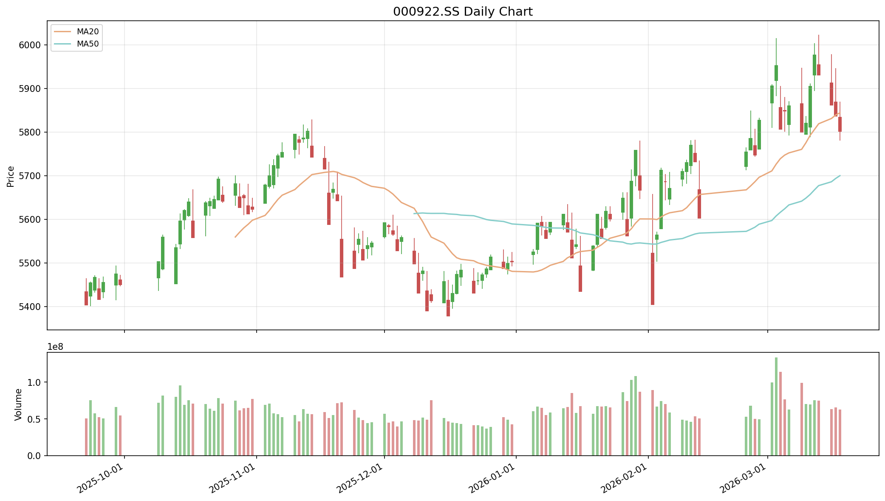
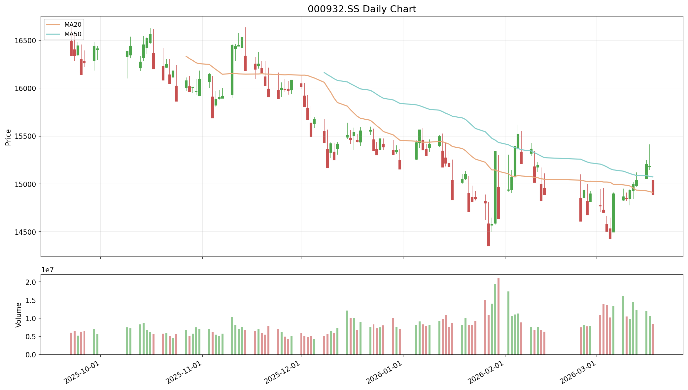
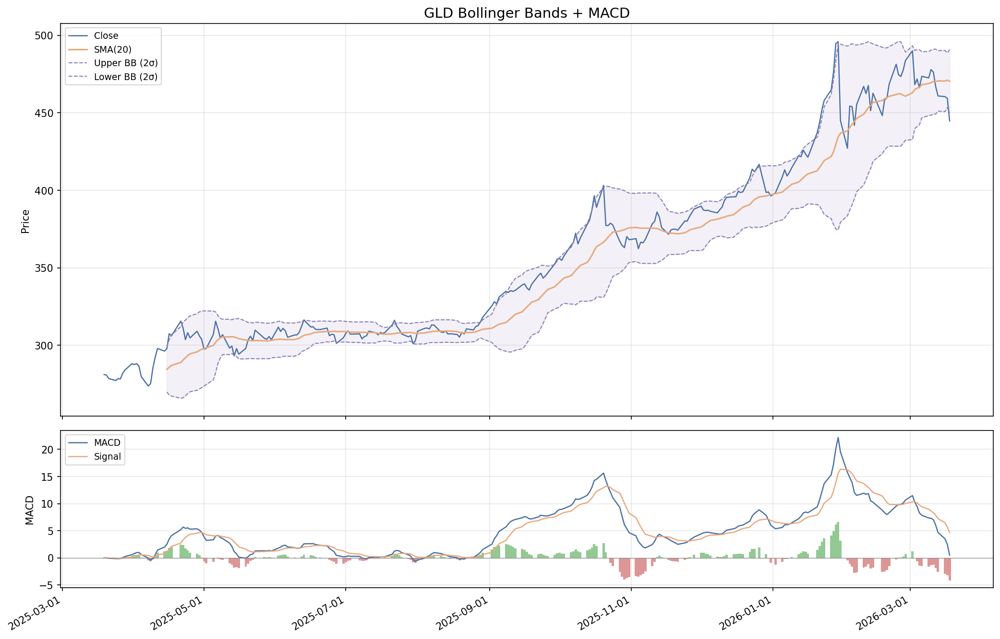
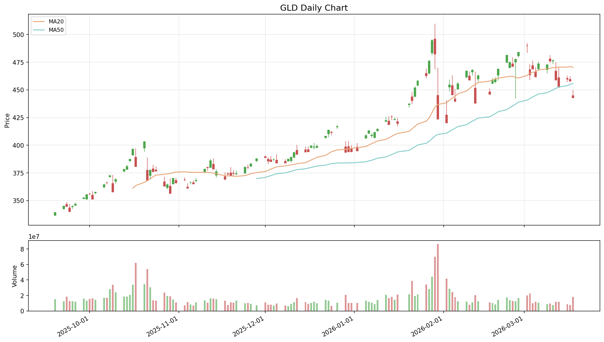
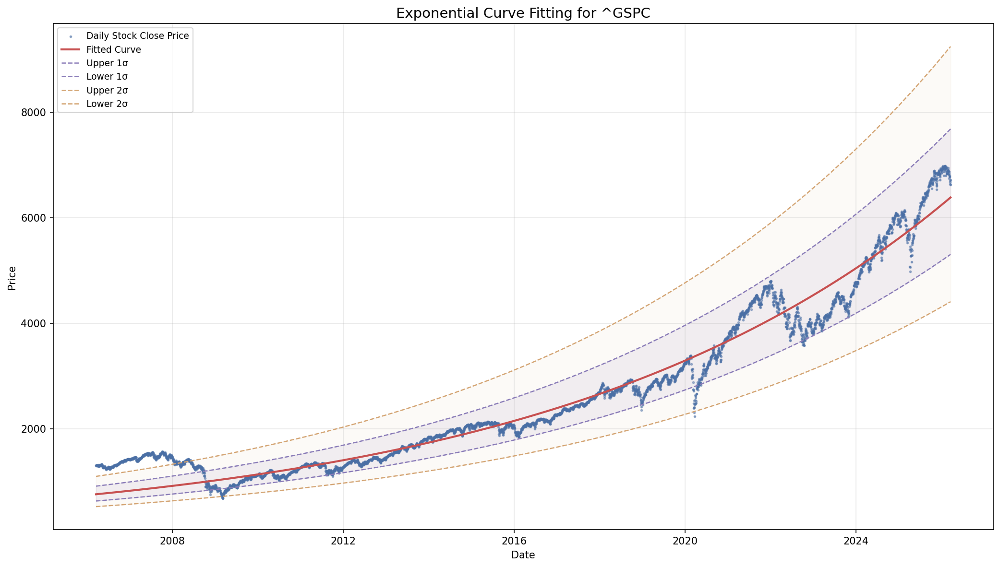
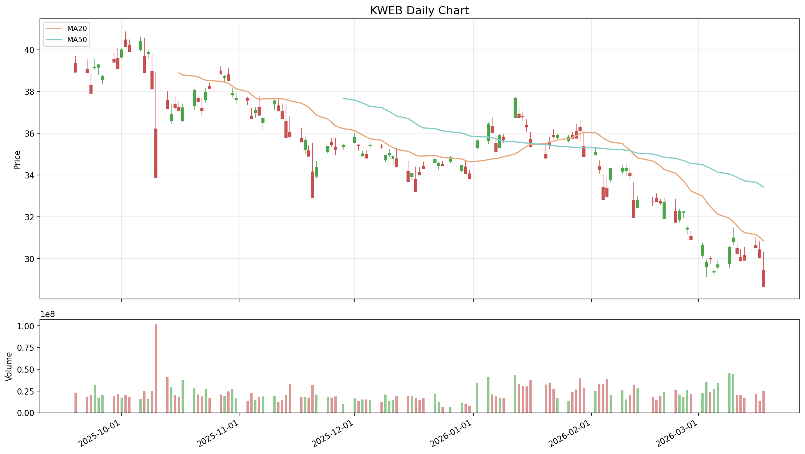
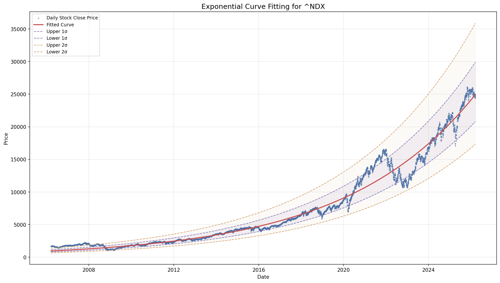

# Quant Juicer Daily Report (2026-03-19 09:05)

## Price Alerts

共 6 条预警：

| 品种 | 类型 | 当前价 | 关键位 | 说明 |
|------|------|--------|--------|------|
| 黄金 (GLD) | MA50 | 444.74 | 455.74 | 黄金 (GLD) 当前价 444.74 接近 MA50 (455.74) |
| 黄金 (GLD) | daily_move | 444.74 | -3.2% | 黄金 (GLD) 大跌 3.2% (当前 444.74) |
| 中概互联 (KWEB) | daily_move | 29.45 | -3.2% | 中概互联 (KWEB) 大跌 3.2% (当前 29.45) |
| 纳指 (^NDX) | MA20 | 24425.09 | 24847.65 | 纳指 (^NDX) 当前价 24425.09 接近 MA20 (24847.65) |
| 纳指 (^NDX) | MA50 | 24425.09 | 25167.06 | 纳指 (^NDX) 当前价 24425.09 接近 MA50 (25167.06) |
| 标普 (^GSPC) | MA20 | 6624.7 | 6803.49 | 标普 (^GSPC) 当前价 6624.70 接近 MA20 (6803.49) |

## Weibo Updates

跳过: WEIBO_COOKIE not set

## Chart Key Findings

- [黄金 (GLD)] BB %B: -12.5% (0=lower, 100=upper)
- [黄金 (GLD)] -> MACD below signal: bearish
- [纳指 (^NDX)] Z-Score: -0.11
- [纳指 (^NDX)] -> Price is within 1 sigma (fairly valued)
- [标普 (^GSPC)] Z-Score: 0.20
- [标普 (^GSPC)] -> Price is within 1 sigma (fairly valued)

## Charts Generated

成功: 7, 失败: 4

