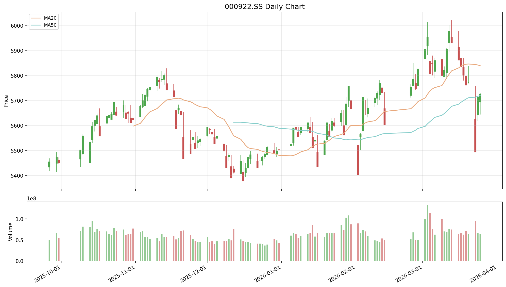
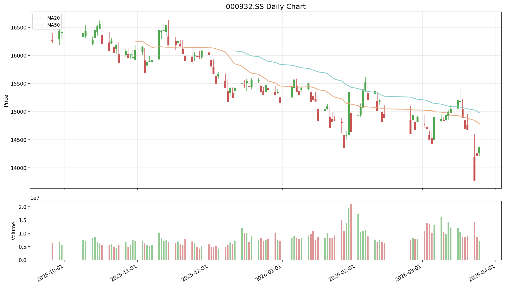
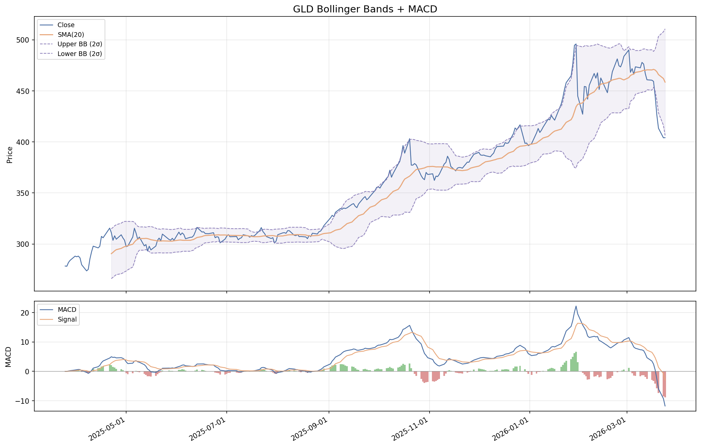
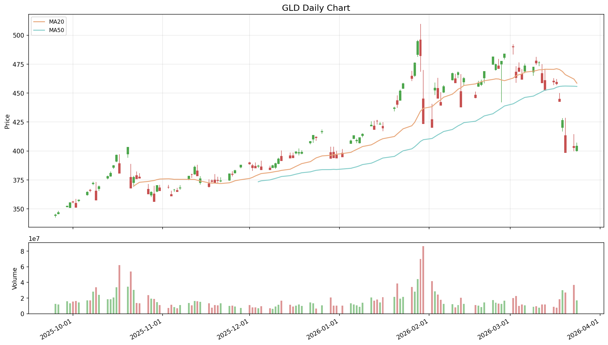
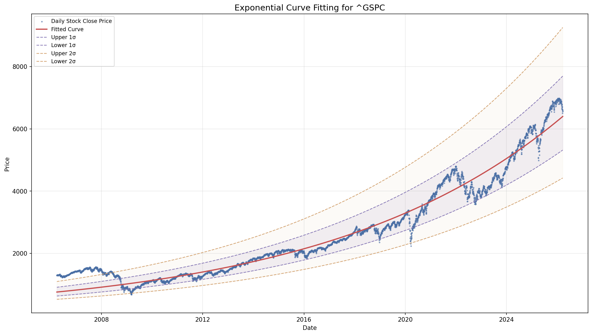
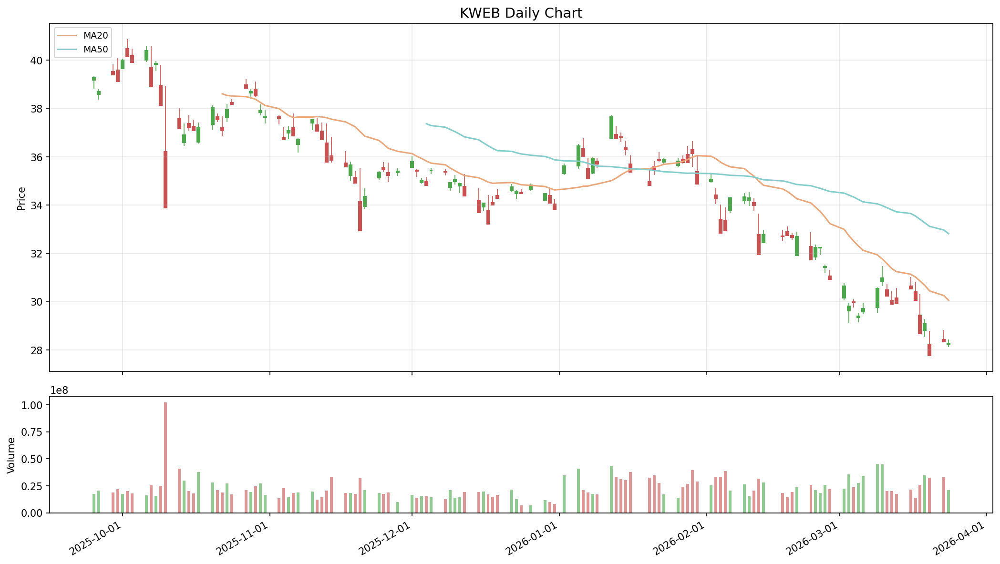
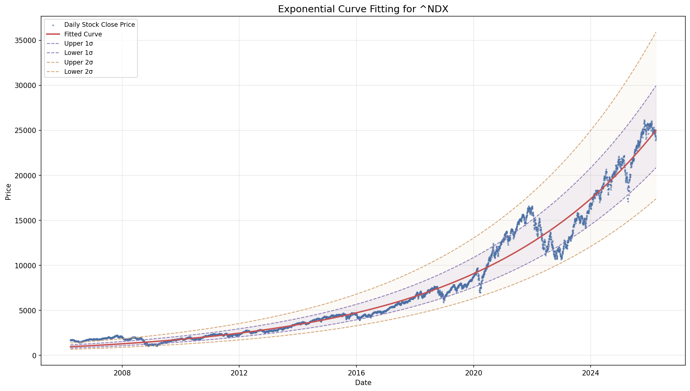

# Quant Juicer Daily Report (2026-03-25 15:55)

## Price Alerts

共 2 条预警：

| 品种 | 类型 | 当前价 | 关键位 | 说明 |
|------|------|--------|--------|------|
| 纳指 (^NDX) | MA20 | 24002.45 | 24695.08 | 纳指 (^NDX) 当前价 24002.45 接近 MA20 (24695.08) |
| 标普 (^GSPC) | MA20 | 6556.37 | 6741.05 | 标普 (^GSPC) 当前价 6556.37 接近 MA20 (6741.05) |

## Weibo Updates

无新帖

## Chart Key Findings

- [黄金 (GLD)] BB %B: -2.2% (0=lower, 100=upper)
- [黄金 (GLD)] -> MACD below signal: bearish
- [纳指 (^NDX)] Z-Score: -0.22
- [纳指 (^NDX)] -> Price is within 1 sigma (fairly valued)
- [标普 (^GSPC)] Z-Score: 0.13
- [标普 (^GSPC)] -> Price is within 1 sigma (fairly valued)

## Charts Generated

成功: 7, 失败: 4

