# Quant Juicer Daily Report (2026-03-29 21:03)

## Price Alerts

共 1 条预警：

| 品种 | 类型 | 当前价 | 关键位 | 说明 |
|------|------|--------|--------|------|
| 黄金 (GLD) | daily_move | 414.7 | +3.5% | 黄金 (GLD) 大涨 3.5% (当前 414.70) |

## Weibo Updates

无新帖

## Chart Key Findings

- [黄金 (GLD)] Put Wall: $370 (OI: 2,347) — support
- [黄金 (GLD)] Call Wall: $425 (OI: 990) — resistance
- [黄金 (GLD)] Flip Point: $409.13
- [黄金 (GLD)] -> Price ABOVE flip: positive gamma environment (stabilizing)
- [黄金 (GLD)] BB %B: 21.6% (0=lower, 100=upper)
- [黄金 (GLD)] -> MACD below signal: bearish
- [中概互联 (KWEB)] Put Wall: $28 (OI: 4,465) — support
- [中概互联 (KWEB)] Call Wall: $32 (OI: 47,271) — resistance
- [中概互联 (KWEB)] Flip Point: $28.96
- [中概互联 (KWEB)] -> Price BELOW flip: negative gamma environment (volatile)
- [纳指 (^NDX)] Z-Score: -0.43
- [纳指 (^NDX)] -> Price is within 1 sigma (fairly valued)
- [标普 (^GSPC)] Z-Score: -0.03
- [标普 (^GSPC)] -> Price is within 1 sigma (fairly valued)

## Charts Generated

成功: 11, 失败: 0

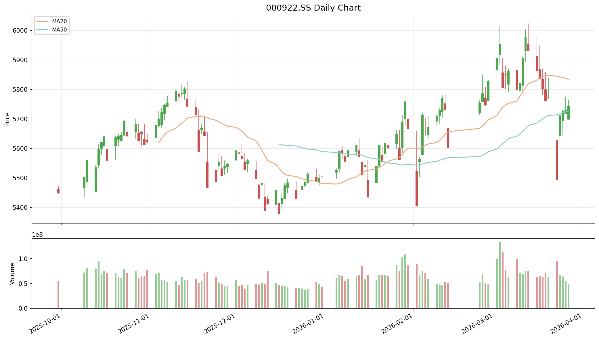

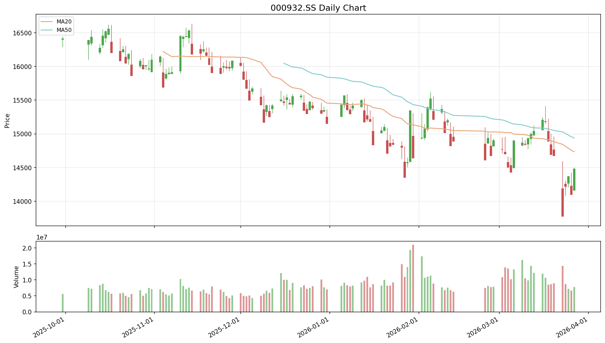

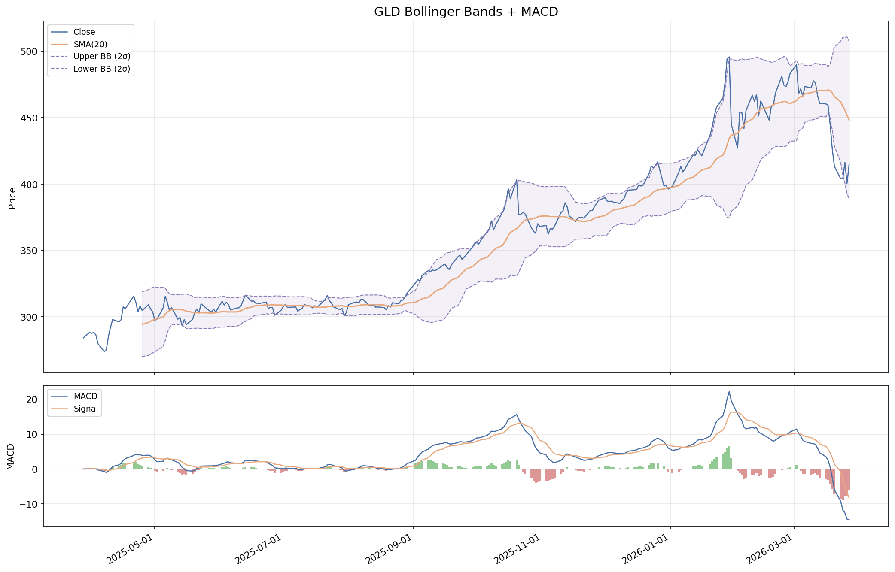

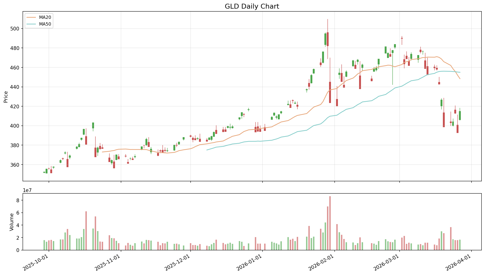

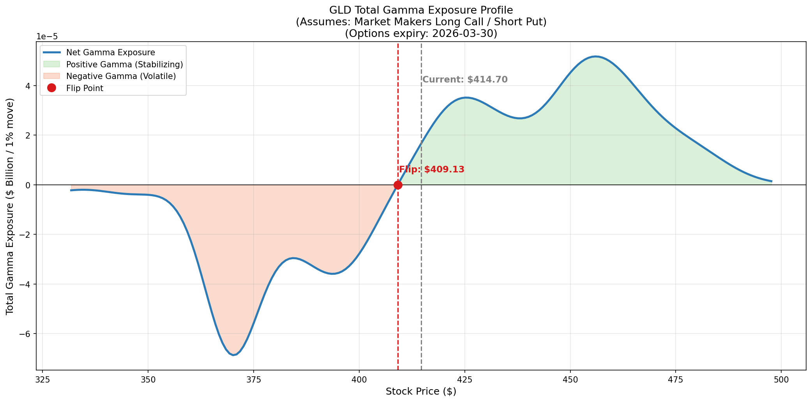

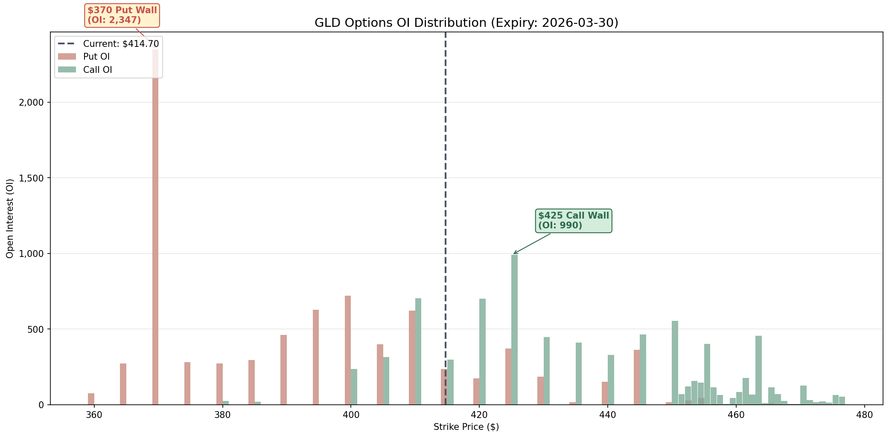

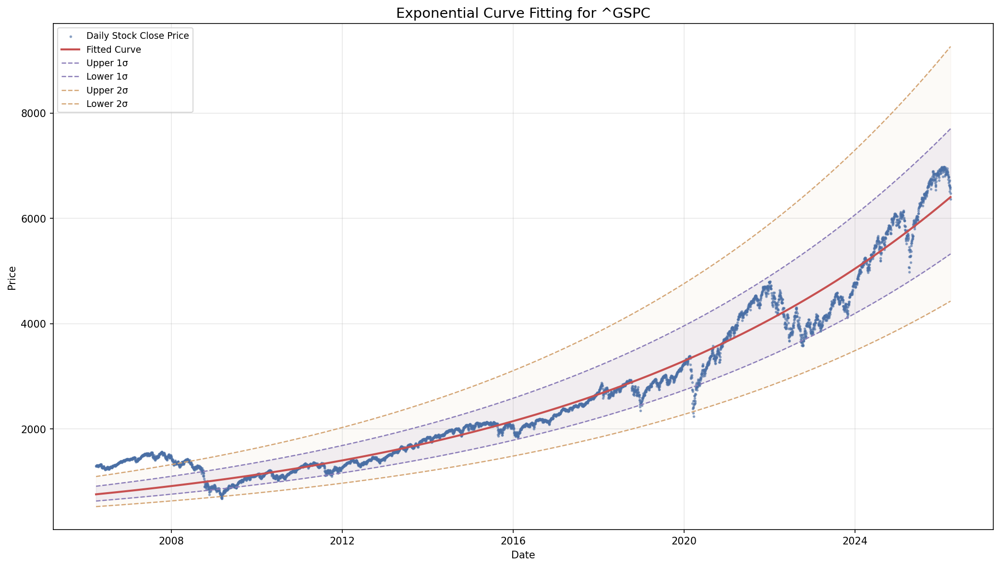

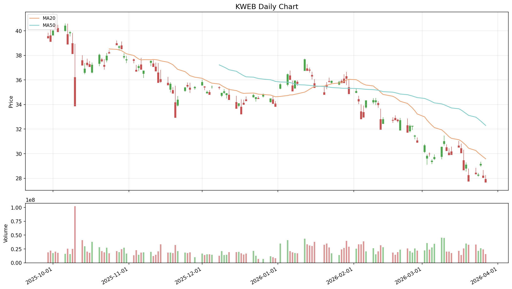

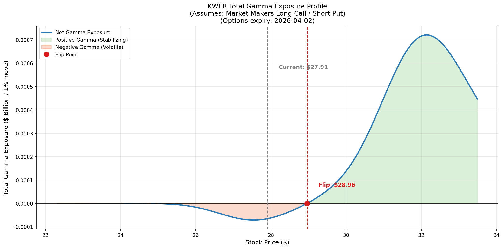

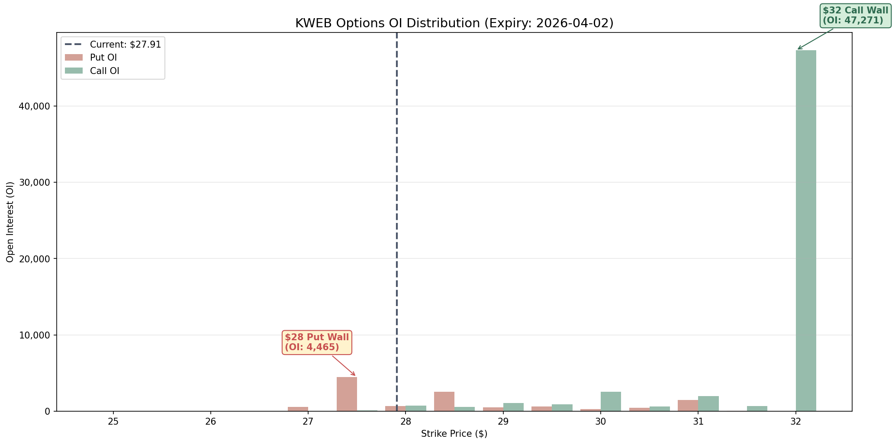

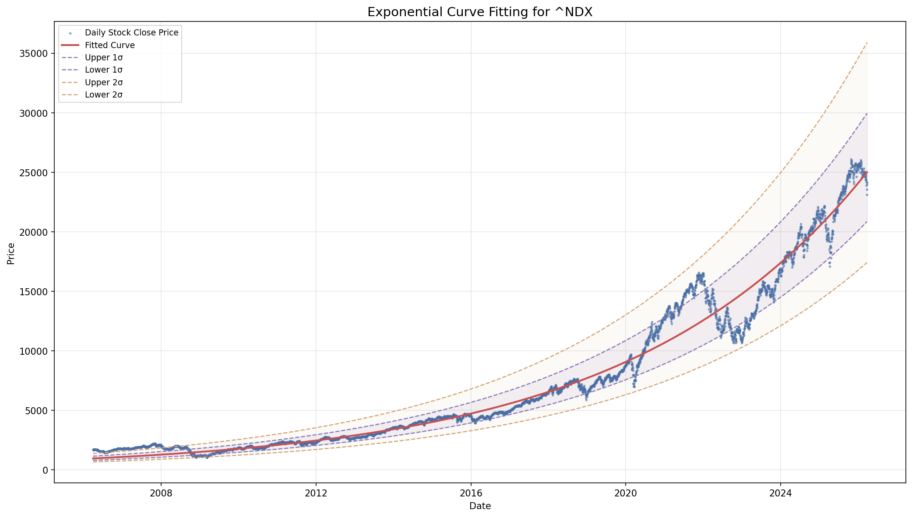

