# Quant Juicer Daily Report (2026-04-05 21:12)

## Price Alerts

共 4 条预警：

| 品种 | 类型 | 当前价 | 关键位 | 说明 |
|------|------|--------|--------|------|
| 黄金 (GLD) | MA20 | 429.41 | 439.2 | 黄金 (GLD) 当前价 429.41 接近 MA20 (439.20) |
| 纳指 (^NDX) | MA20 | 24045.53 | 24219.66 | 纳指 (^NDX) 当前价 24045.53 接近 MA20 (24219.66) |
| 标普 (^GSPC) | MA20 | 6582.69 | 6607.84 | 标普 (^GSPC) 当前价 6582.69 接近 MA20 (6607.84) |
| 标普 (^GSPC) | MA50 | 6582.69 | 6783.63 | 标普 (^GSPC) 当前价 6582.69 接近 MA50 (6783.63) |

## Weibo Updates

新增 6 条帖子

## Chart Key Findings

- [黄金 (GLD)] Put Wall: $385 (OI: 1,778) — support
- [黄金 (GLD)] Call Wall: $440 (OI: 4,200) — resistance
- [黄金 (GLD)] Flip Point: $415.51
- [黄金 (GLD)] -> Price ABOVE flip: positive gamma environment (stabilizing)
- [黄金 (GLD)] BB %B: 41.0% (0=lower, 100=upper)
- [黄金 (GLD)] -> MACD above signal: bullish
- [中概互联 (KWEB)] Put Wall: $30 (OI: 4,340) — support
- [中概互联 (KWEB)] Call Wall: $30 (OI: 4,968) — resistance
- [中概互联 (KWEB)] Flip Point: $28.63
- [中概互联 (KWEB)] -> Price BELOW flip: negative gamma environment (volatile)
- [纳指 (^NDX)] Z-Score: -0.23
- [纳指 (^NDX)] -> Price is within 1 sigma (fairly valued)
- [标普 (^GSPC)] Z-Score: 0.14
- [标普 (^GSPC)] -> Price is within 1 sigma (fairly valued)

## Charts Generated

成功: 9, 失败: 2

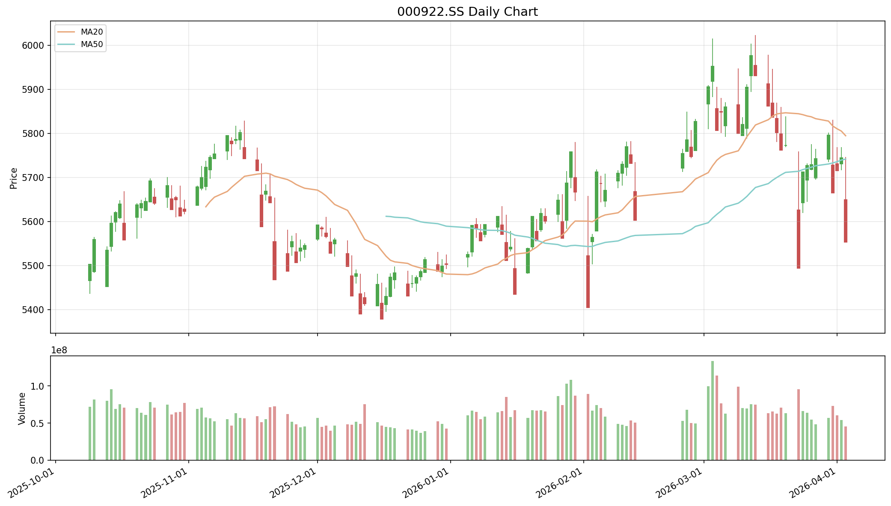

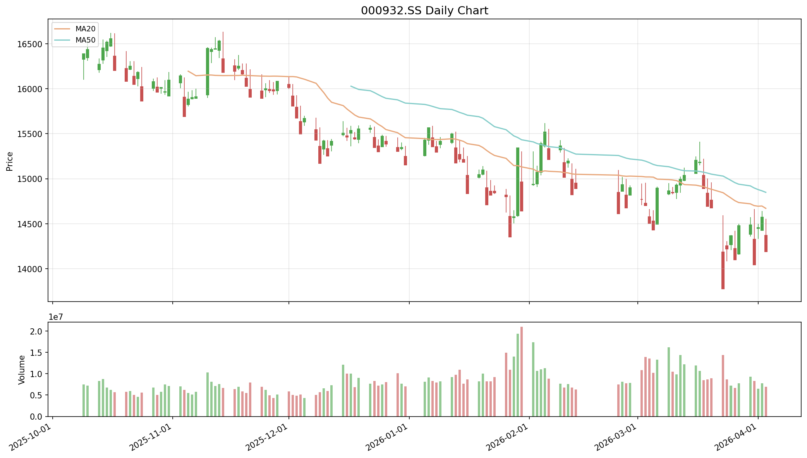

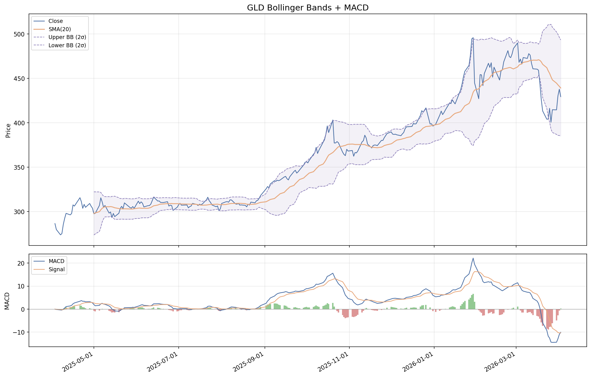

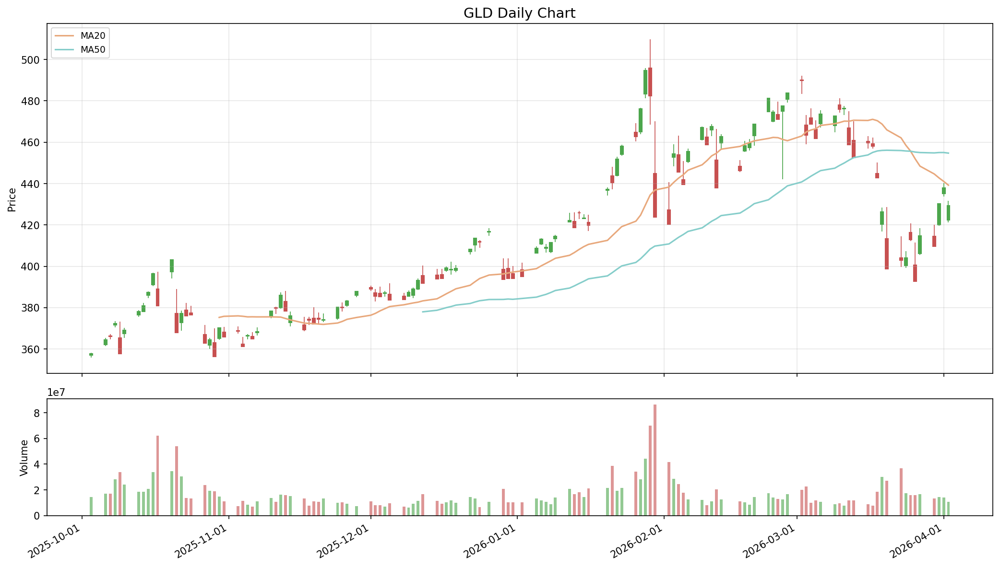

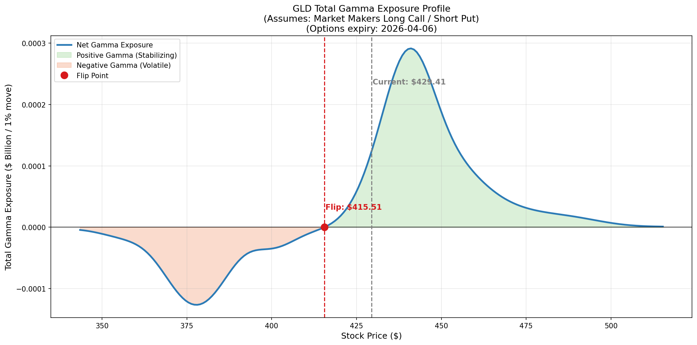

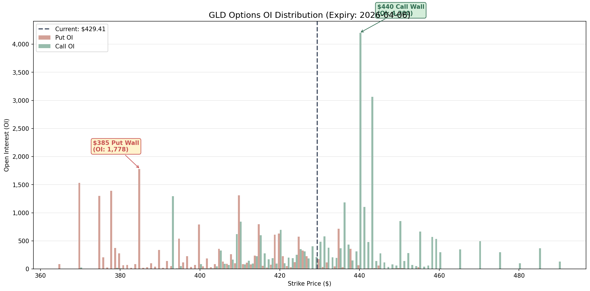

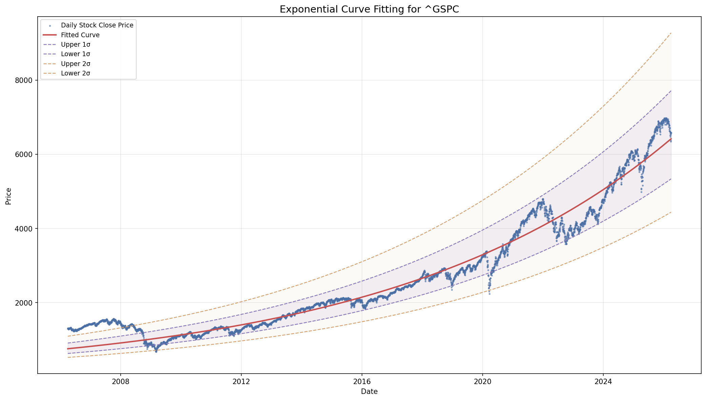

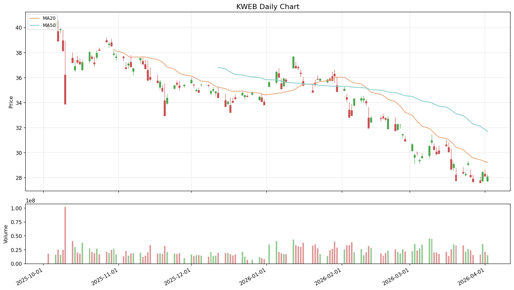

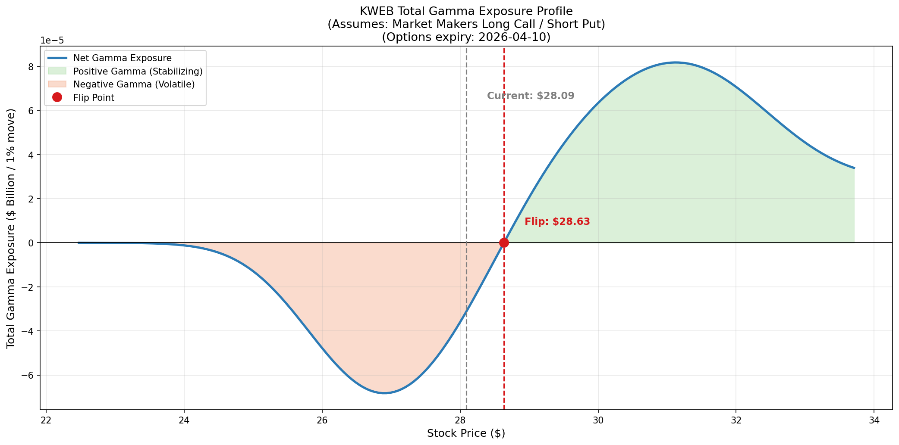

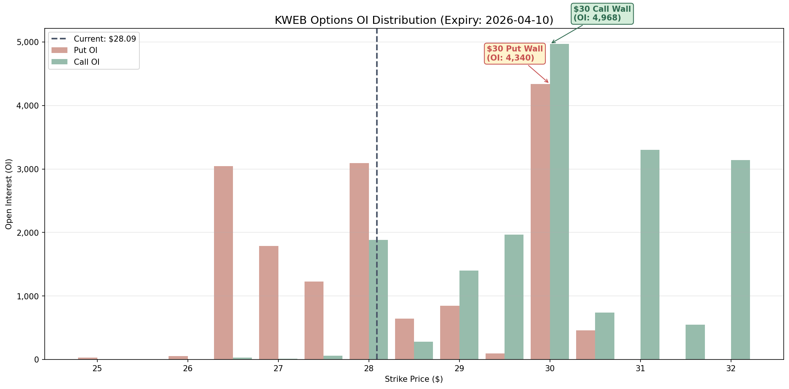

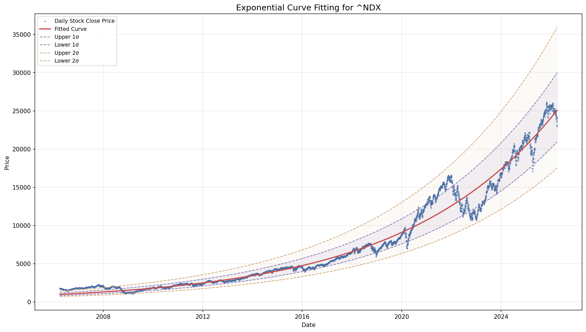

