# Quant Juicer Daily Report (2026-04-08 18:16)

## Price Alerts

共 5 条预警：

| 品种 | 类型 | 当前价 | 关键位 | 说明 |
|------|------|--------|--------|------|
| 黄金 (GLD) | MA20 | 431.81 | 434.87 | 黄金 (GLD) 当前价 431.81 接近 MA20 (434.87) |
| 纳指 (^NDX) | MA20 | 24202.37 | 24158.87 | 纳指 (^NDX) 当前价 24202.37 接近 MA20 (24158.87) |
| 纳指 (^NDX) | MA50 | 24202.37 | 24735.14 | 纳指 (^NDX) 当前价 24202.37 接近 MA50 (24735.14) |
| 标普 (^GSPC) | MA20 | 6616.85 | 6592.47 | 标普 (^GSPC) 当前价 6616.85 接近 MA20 (6592.47) |
| 标普 (^GSPC) | MA50 | 6616.85 | 6771.62 | 标普 (^GSPC) 当前价 6616.85 接近 MA50 (6771.62) |

## Weibo Updates

新增 10 条帖子

## Chart Key Findings

- [黄金 (GLD)] -> Entirely negative gamma (volatile)
- [黄金 (GLD)] BB %B: 46.9% (0=lower, 100=upper)
- [黄金 (GLD)] -> MACD above signal: bullish
- [中概互联 (KWEB)] Flip Point: $28.87
- [中概互联 (KWEB)] -> Price BELOW flip: negative gamma environment (volatile)
- [纳指 (^NDX)] Z-Score: -0.21
- [纳指 (^NDX)] -> Price is within 1 sigma (fairly valued)
- [标普 (^GSPC)] Z-Score: 0.16
- [标普 (^GSPC)] -> Price is within 1 sigma (fairly valued)

## Charts Generated

成功: 11, 失败: 0

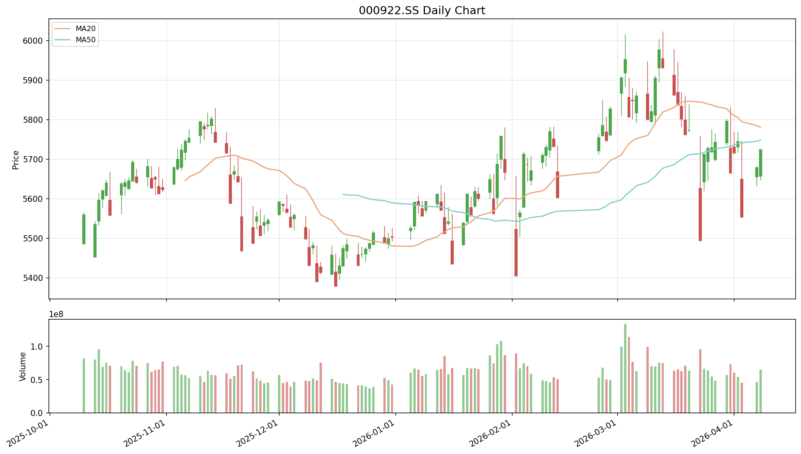

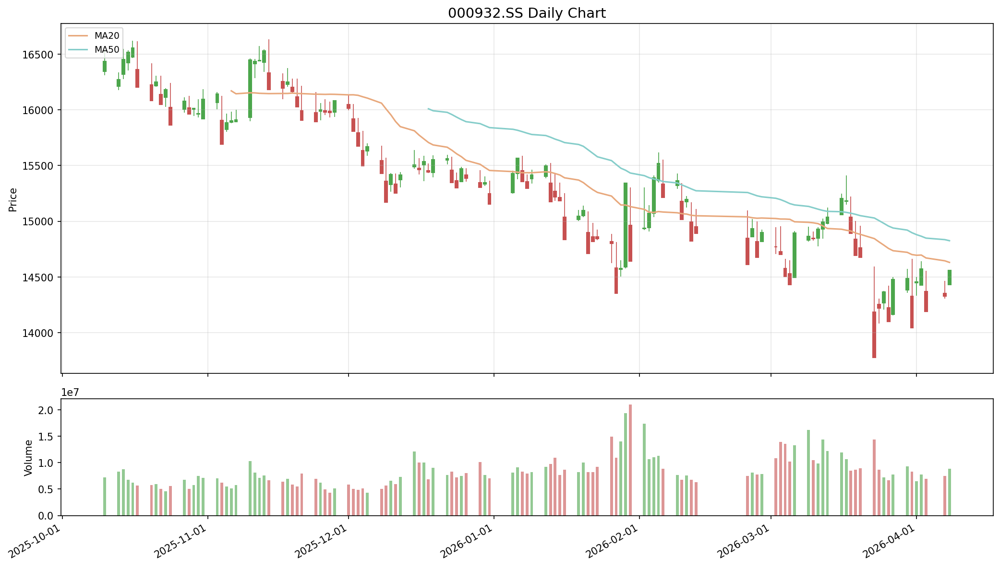

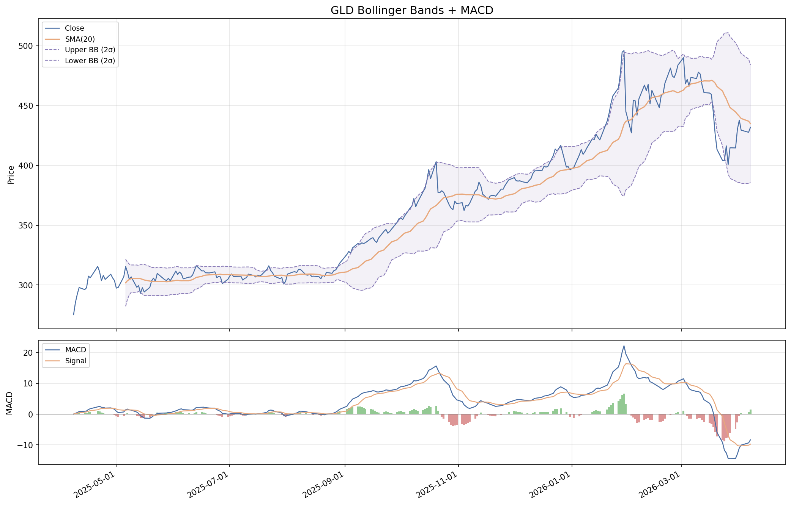

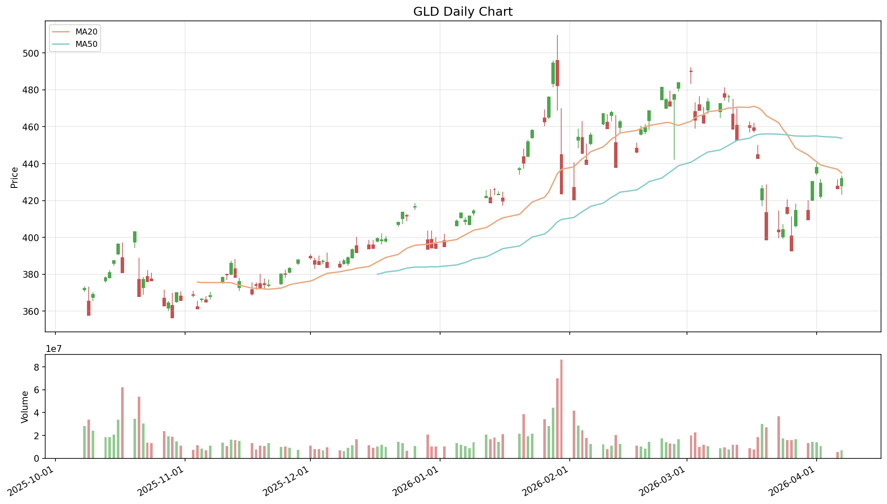

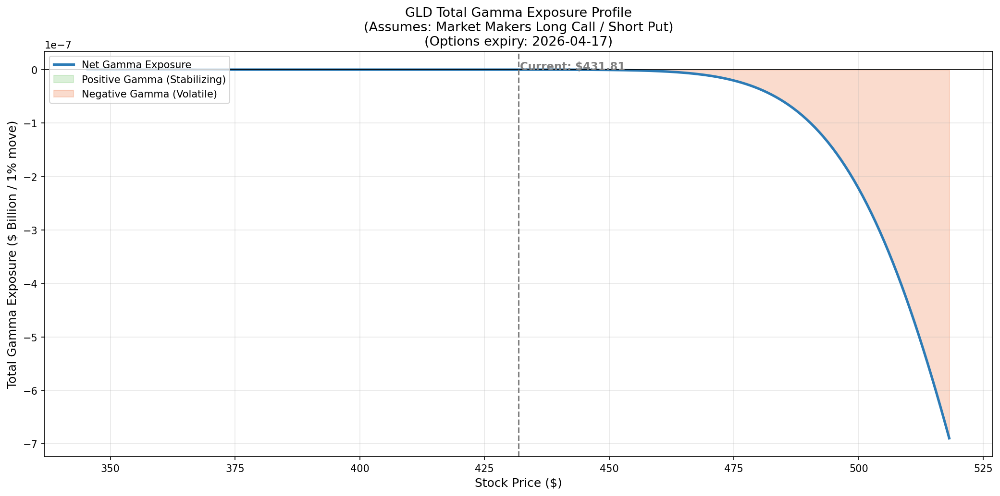

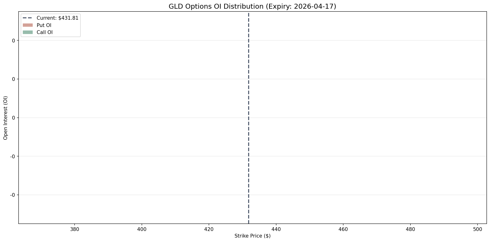

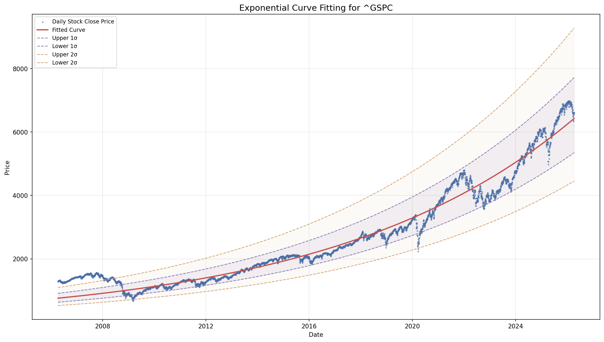

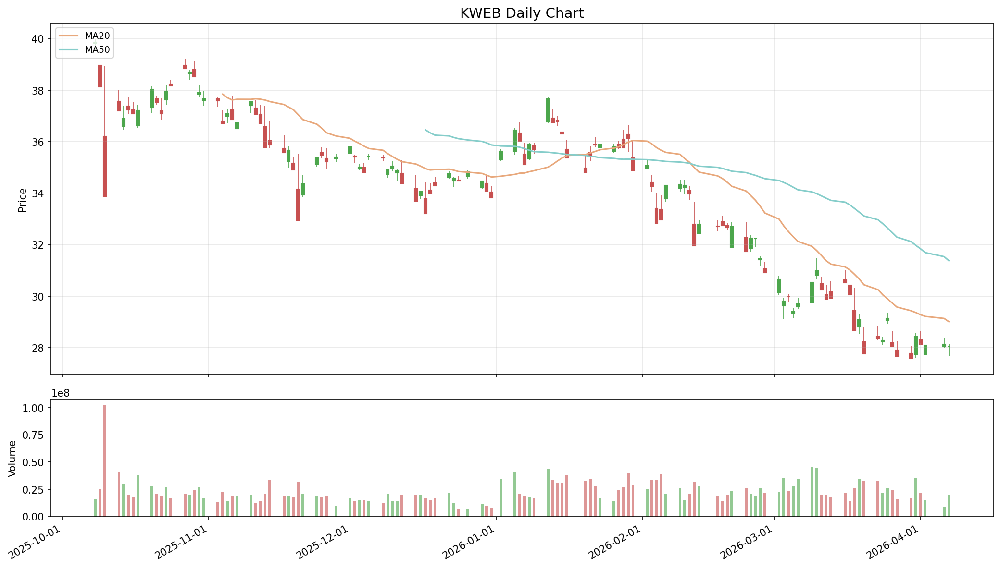

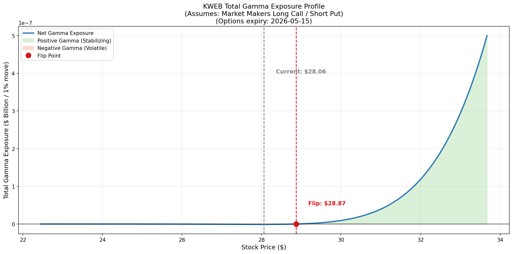

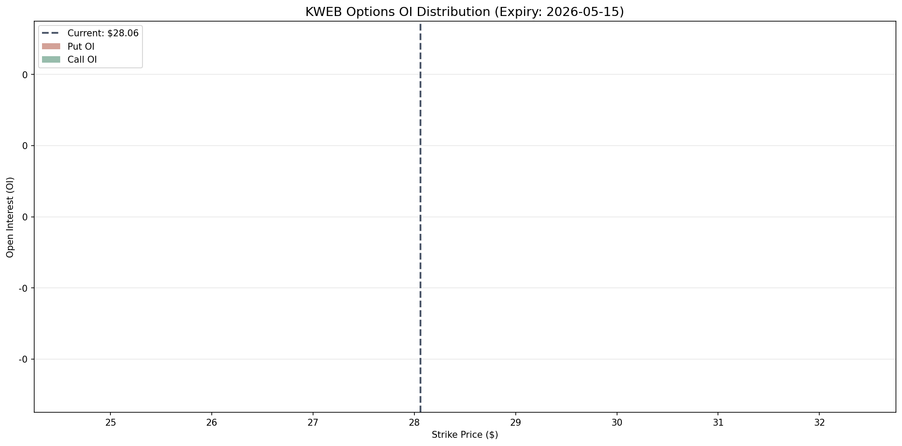

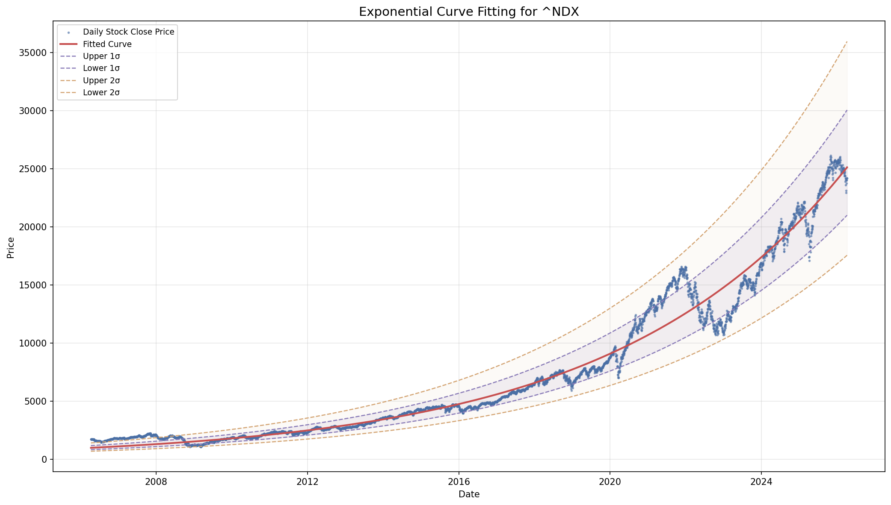

