# Quant Juicer Daily Report (2026-04-13 15:36)

## Price Alerts

共 4 条预警：

| 品种 | 类型 | 当前价 | 关键位 | 说明 |
|------|------|--------|--------|------|
| 黄金 (GLD) | MA20 | 437.13 | 429.3 | 黄金 (GLD) 当前价 437.13 接近 MA20 (429.30) |
| 中概互联 (KWEB) | MA20 | 28.7 | 28.77 | 中概互联 (KWEB) 当前价 28.70 接近 MA20 (28.77) |
| 纳指 (^NDX) | MA50 | 25116.34 | 24683.66 | 纳指 (^NDX) 当前价 25116.34 接近 MA50 (24683.66) |
| 标普 (^GSPC) | MA50 | 6816.89 | 6761.97 | 标普 (^GSPC) 当前价 6816.89 接近 MA50 (6761.97) |

## Weibo Updates

新增 9 条帖子

## Chart Key Findings

- [黄金 (GLD)] -> Entirely negative gamma (volatile)
- [黄金 (GLD)] BB %B: 60.8% (0=lower, 100=upper)
- [黄金 (GLD)] -> MACD above signal: bullish
- [中概互联 (KWEB)] Flip Point: $31.77
- [中概互联 (KWEB)] -> Price BELOW flip: negative gamma environment (volatile)
- [纳指 (^NDX)] Z-Score: -0.01
- [纳指 (^NDX)] -> Price is within 1 sigma (fairly valued)
- [标普 (^GSPC)] Z-Score: 0.31
- [标普 (^GSPC)] -> Price is within 1 sigma (fairly valued)

## Charts Generated

成功: 9, 失败: 2

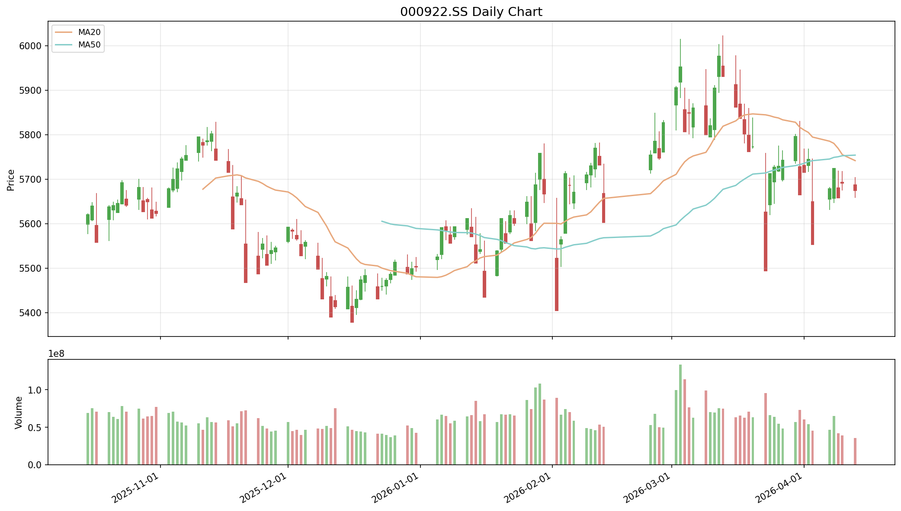

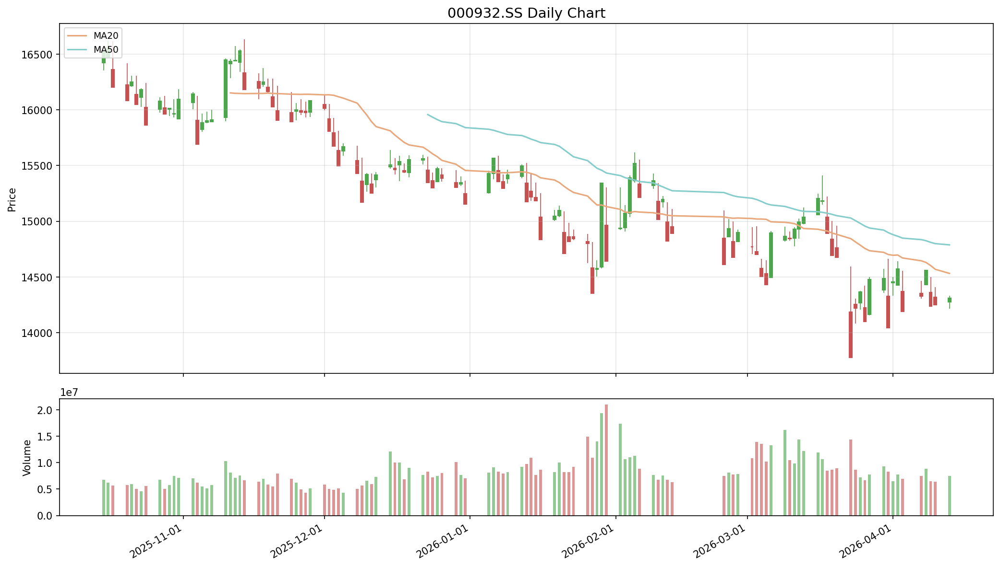

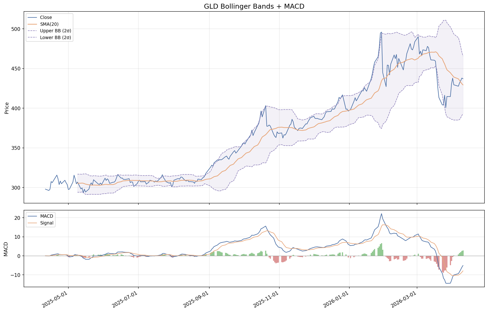

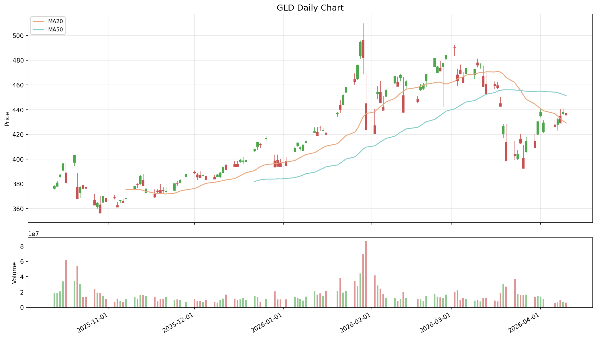

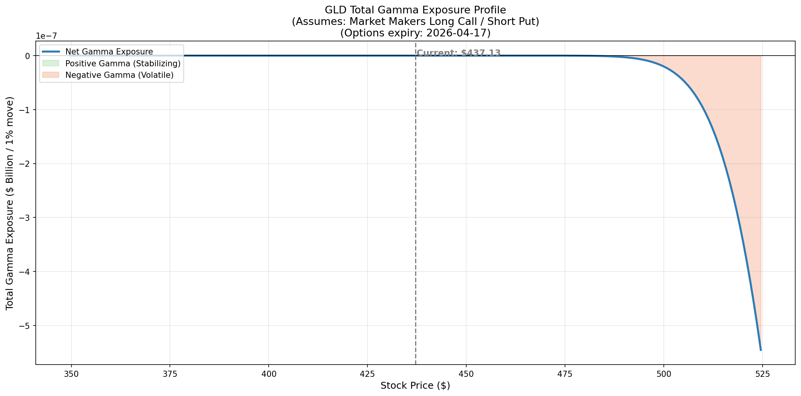

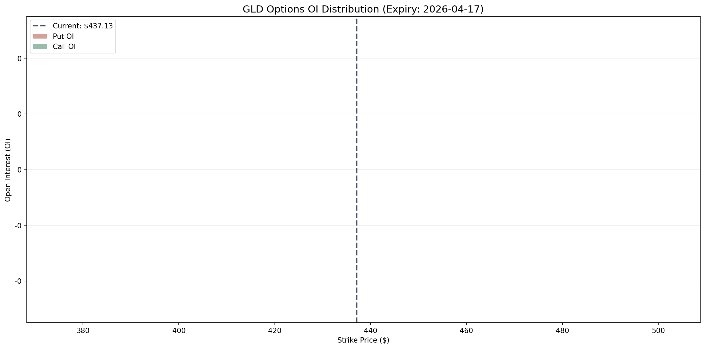

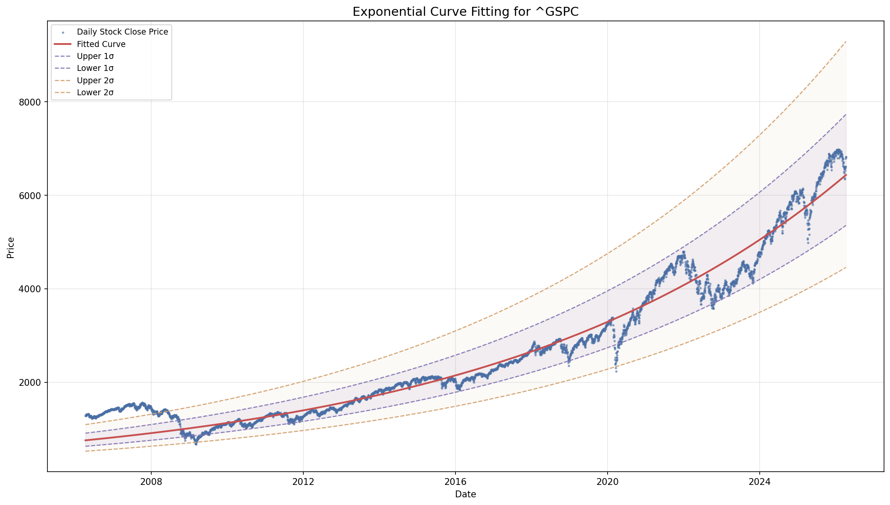

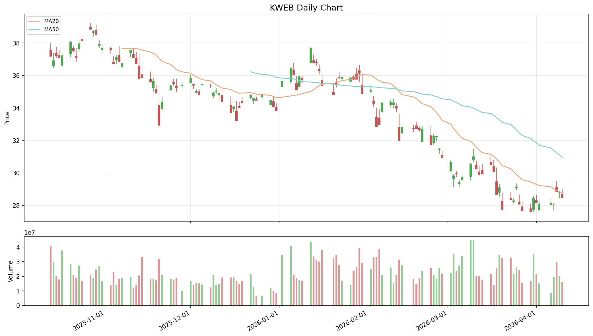

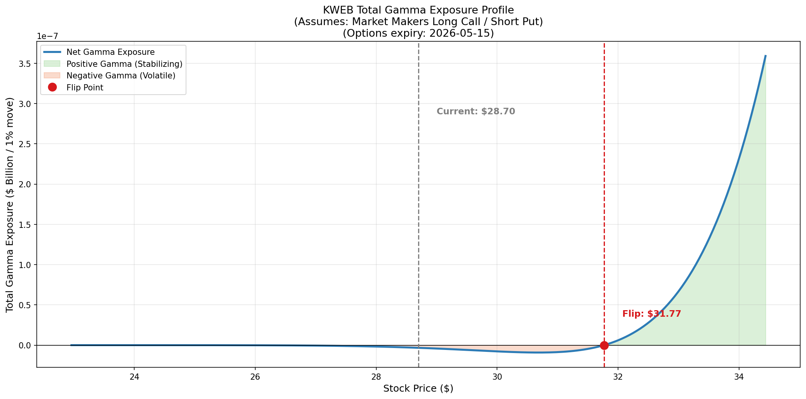

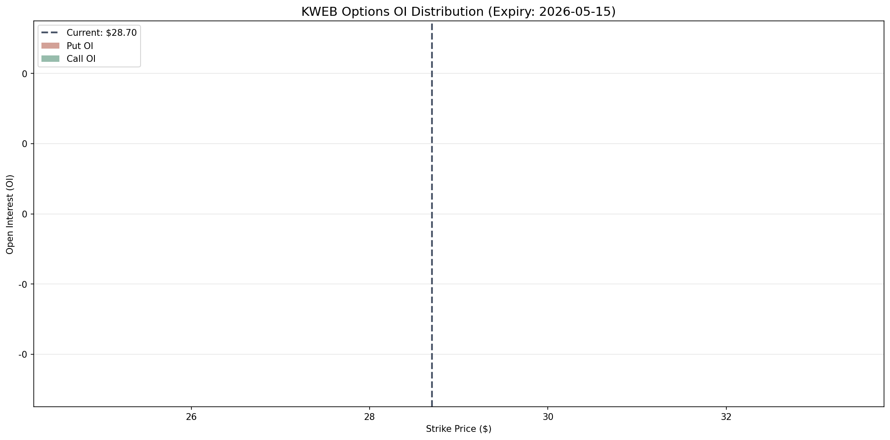

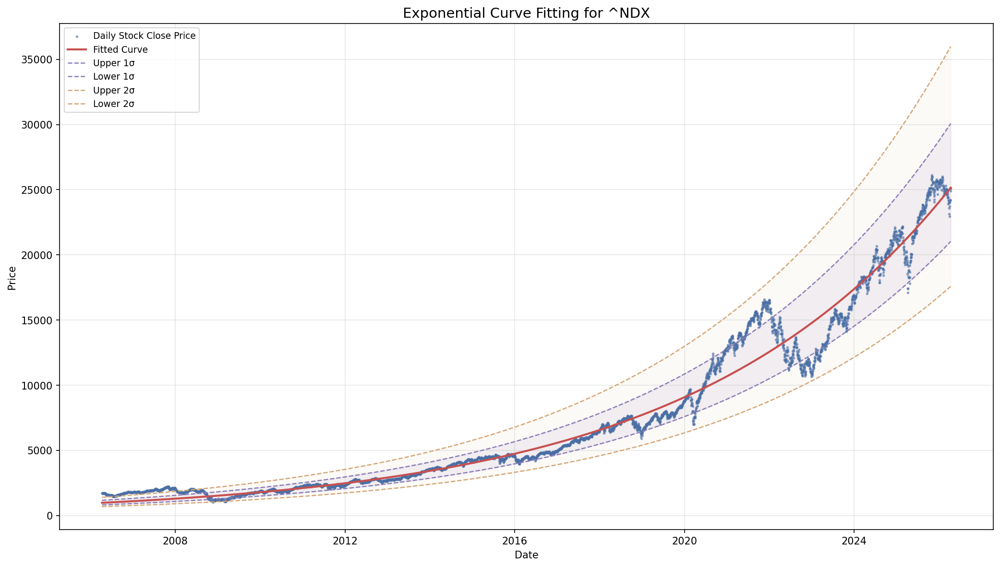

