# Quant Juicer Daily Report (2026-04-21 15:38)

## Price Alerts

共 2 条预警：

| 品种 | 类型 | 当前价 | 关键位 | 说明 |
|------|------|--------|--------|------|
| 黄金 (GLD) | MA50 | 442.09 | 449.8 | 黄金 (GLD) 当前价 442.09 接近 MA50 (449.80) |
| 中概互联 (KWEB) | MA50 | 30.29 | 30.37 | 中概互联 (KWEB) 当前价 30.29 接近 MA50 (30.37) |

## Weibo Updates

新增 11 条帖子

## Chart Key Findings

- [黄金 (GLD)] -> Entirely positive gamma (stabilizing)
- [黄金 (GLD)] BB %B: 73.7% (0=lower, 100=upper)
- [黄金 (GLD)] -> MACD above signal: bullish
- [中概互联 (KWEB)] Put Wall: $33 (OI: 1) — support
- [中概互联 (KWEB)] Call Wall: $34 (OI: 100) — resistance
- [中概互联 (KWEB)] Flip Point: $29.32
- [中概互联 (KWEB)] -> Price ABOVE flip: positive gamma environment (stabilizing)
- [纳指 (^NDX)] Z-Score: 0.28
- [纳指 (^NDX)] -> Price is within 1 sigma (fairly valued)
- [标普 (^GSPC)] Z-Score: 0.52
- [标普 (^GSPC)] -> Price is within 1 sigma (fairly valued)

## Charts Generated

成功: 11, 失败: 0

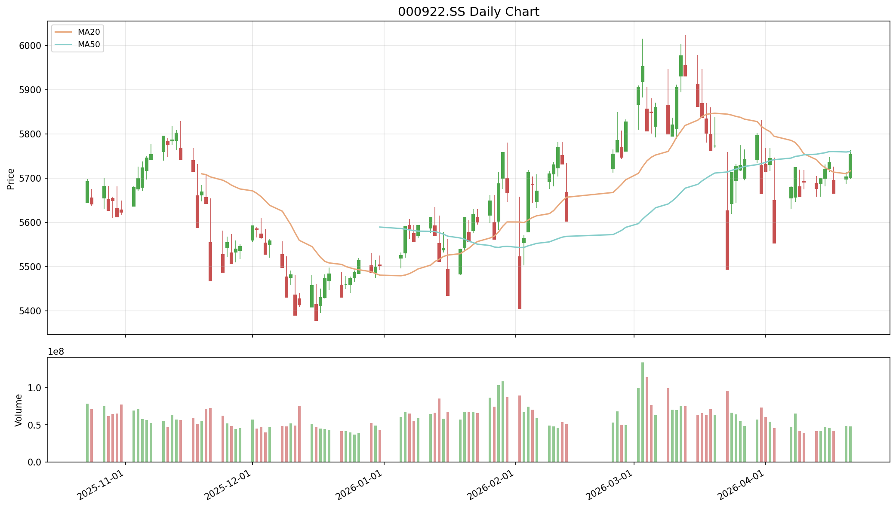

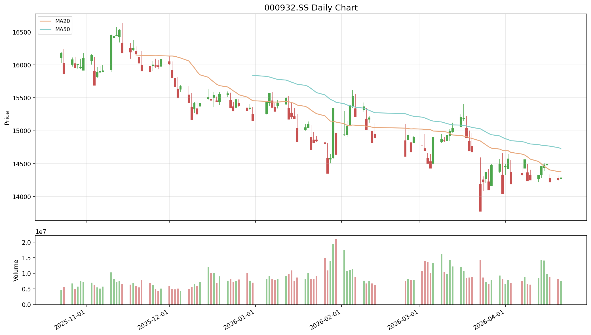

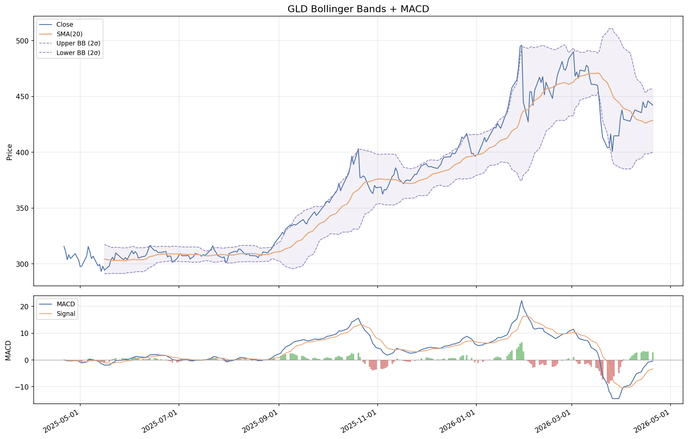

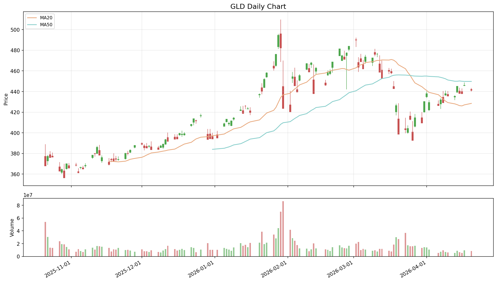

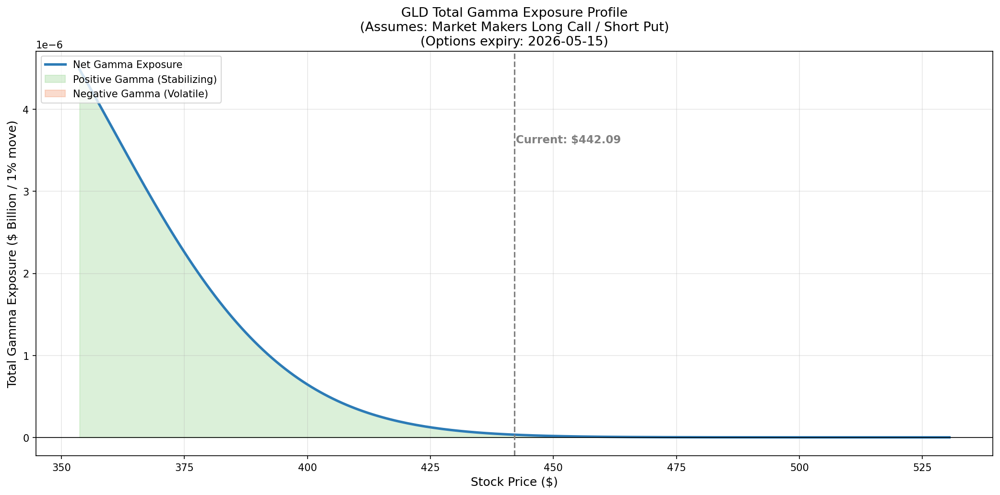

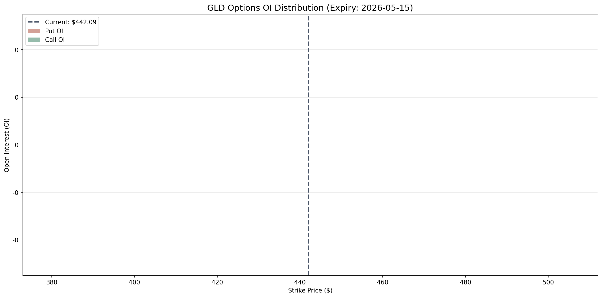

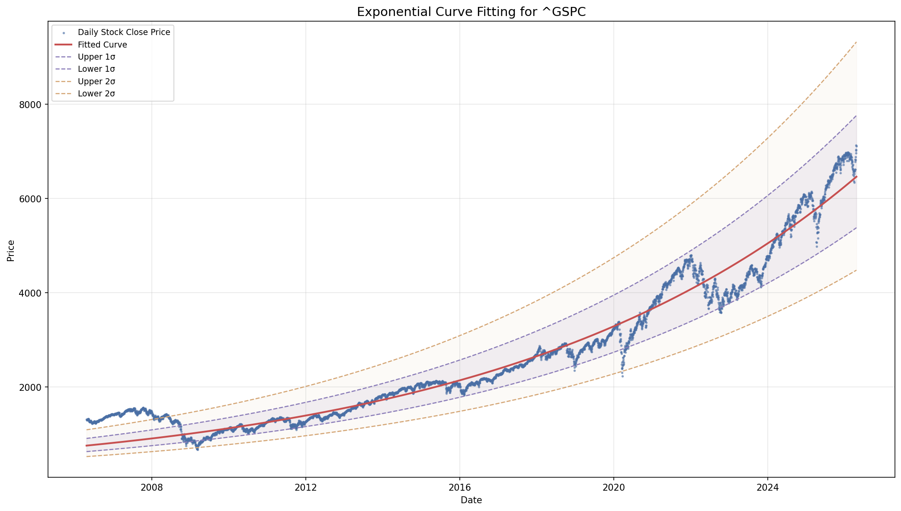

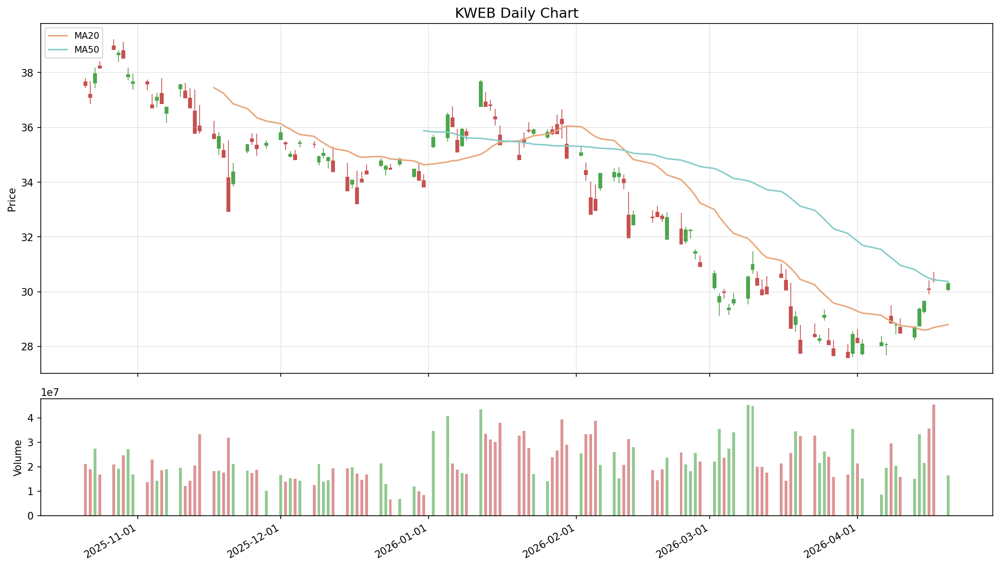

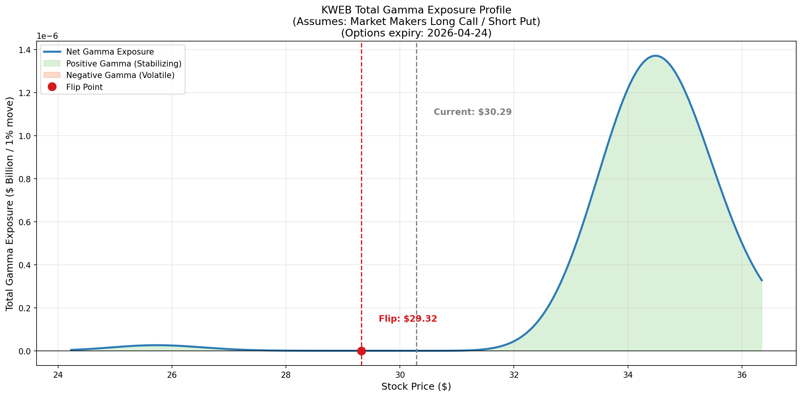

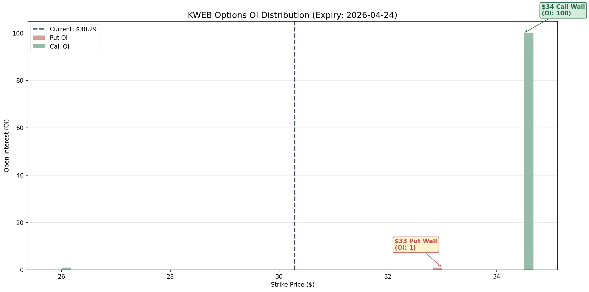

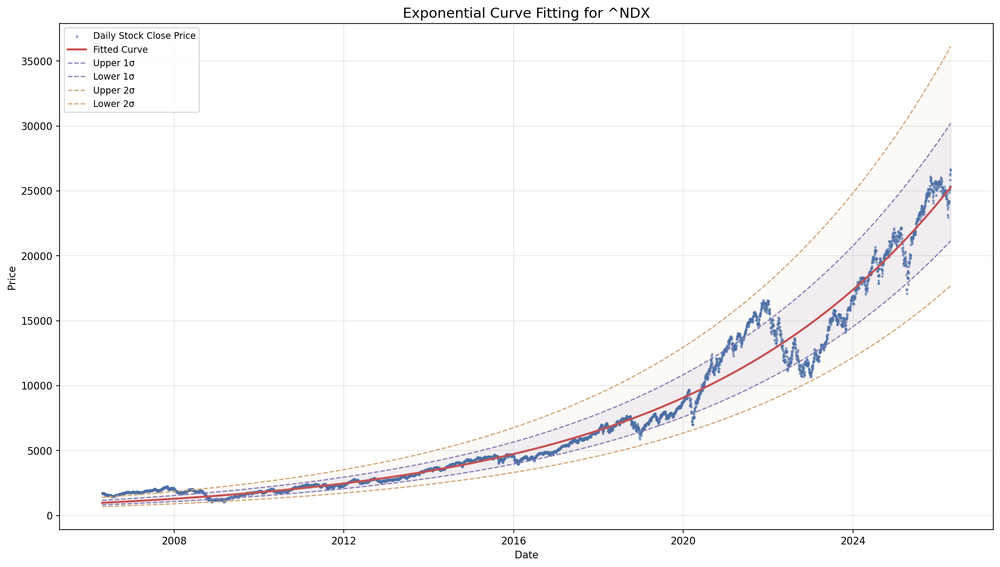

