# Quant Juicer Daily Report (2026-04-26 21:04)

## Price Alerts

共 2 条预警：

| 品种 | 类型 | 当前价 | 关键位 | 说明 |
|------|------|--------|--------|------|
| 黄金 (GLD) | MA20 | 433.25 | 433.7 | 黄金 (GLD) 当前价 433.25 接近 MA20 (433.70) |
| 中概互联 (KWEB) | MA20 | 28.83 | 28.89 | 中概互联 (KWEB) 当前价 28.83 接近 MA20 (28.89) |

## Weibo Updates

新增 7 条帖子

## Chart Key Findings

- [黄金 (GLD)] Put Wall: $380 (OI: 1,332) — support
- [黄金 (GLD)] Call Wall: $450 (OI: 1,356) — resistance
- [黄金 (GLD)] Flip Point: $433.07
- [黄金 (GLD)] -> Price ABOVE flip: positive gamma environment (stabilizing)
- [黄金 (GLD)] BB %B: 48.7% (0=lower, 100=upper)
- [黄金 (GLD)] -> MACD above signal: bullish
- [中概互联 (KWEB)] Put Wall: $28 (OI: 4,722) — support
- [中概互联 (KWEB)] Call Wall: $32 (OI: 16,906) — resistance
- [中概互联 (KWEB)] Flip Point: $28.16
- [中概互联 (KWEB)] -> Price ABOVE flip: positive gamma environment (stabilizing)
- [纳指 (^NDX)] Z-Score: 0.42
- [纳指 (^NDX)] -> Price is within 1 sigma (fairly valued)
- [标普 (^GSPC)] Z-Score: 0.55
- [标普 (^GSPC)] -> Price is within 1 sigma (fairly valued)

## Charts Generated

成功: 9, 失败: 2

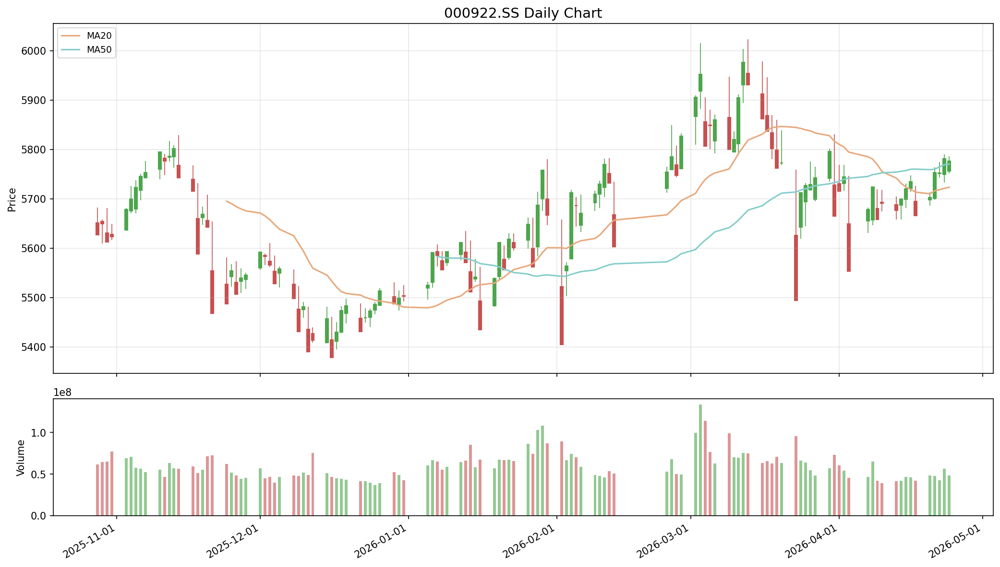

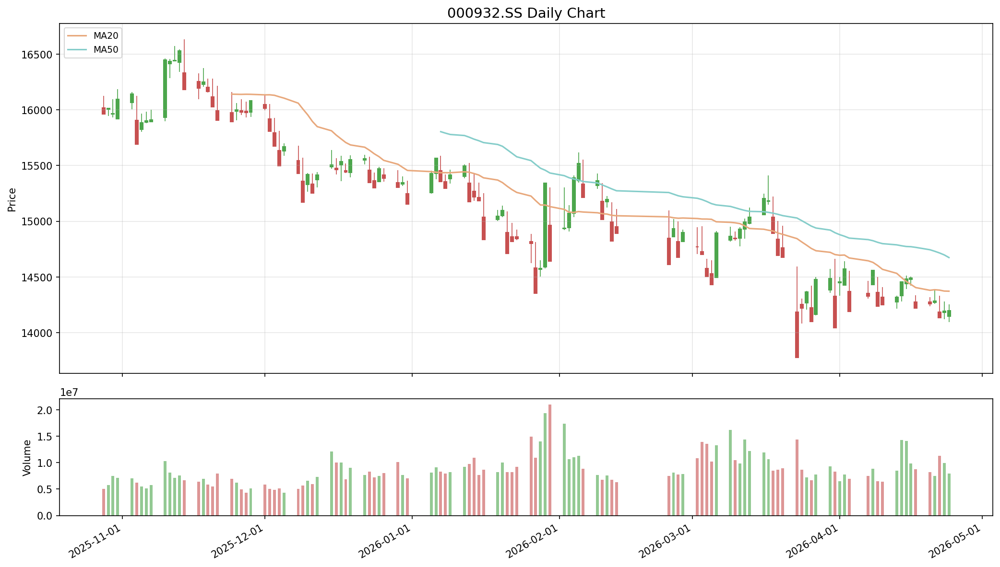

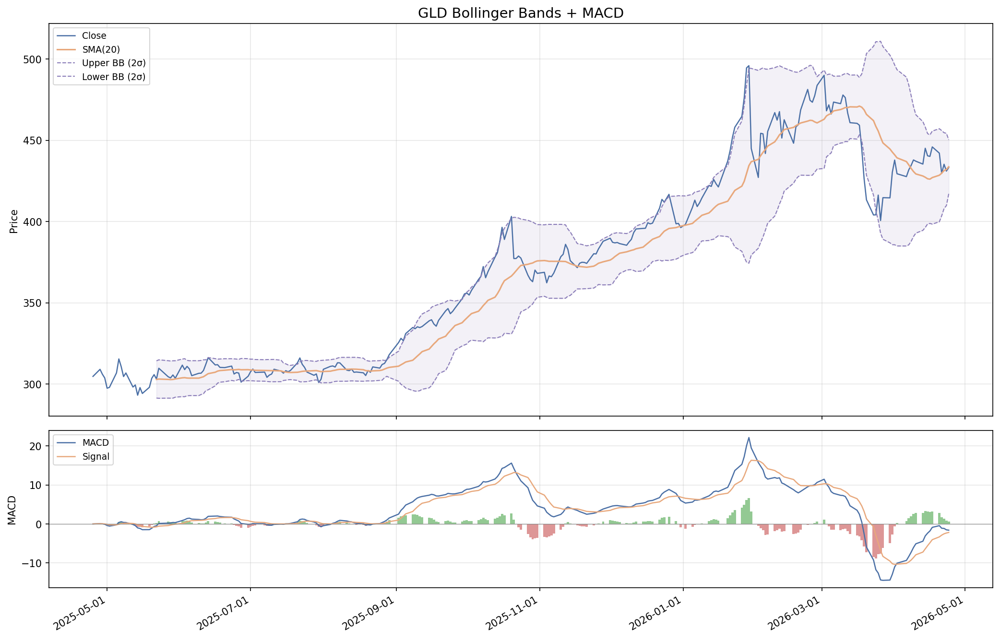

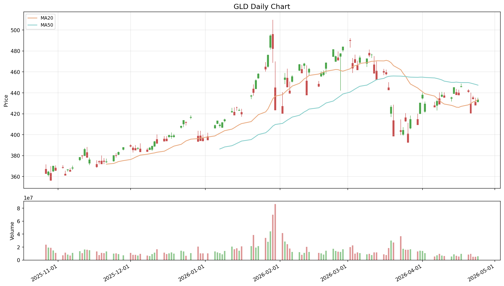

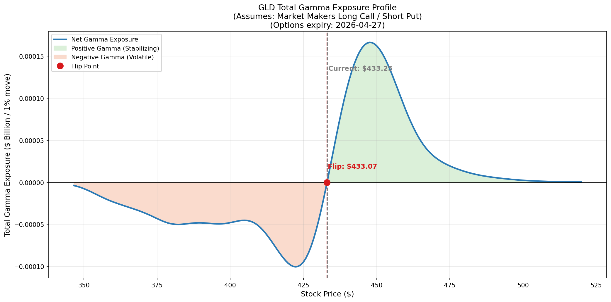

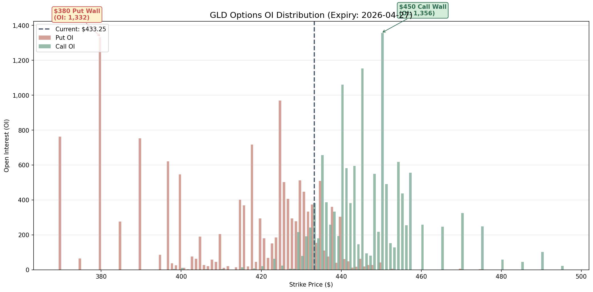

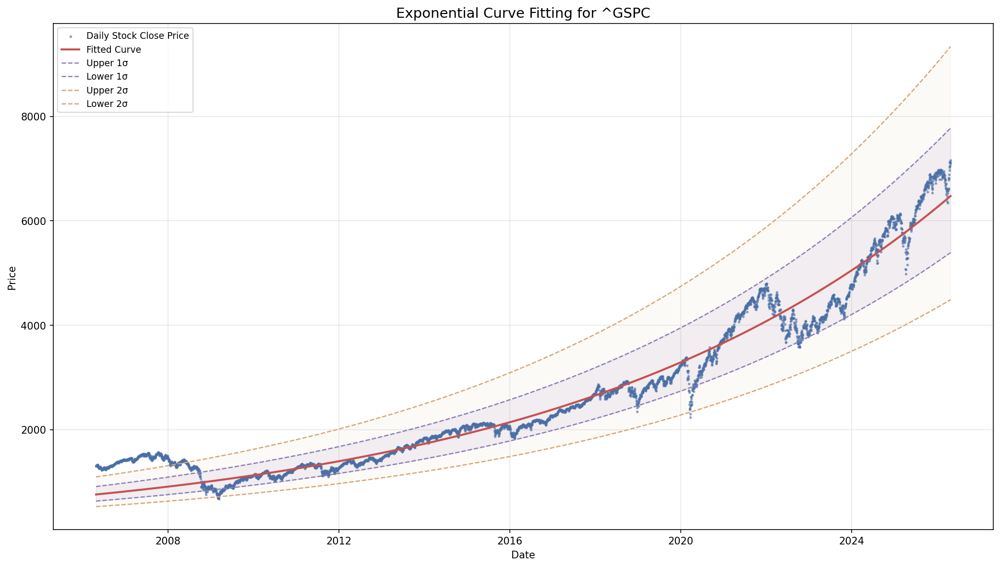

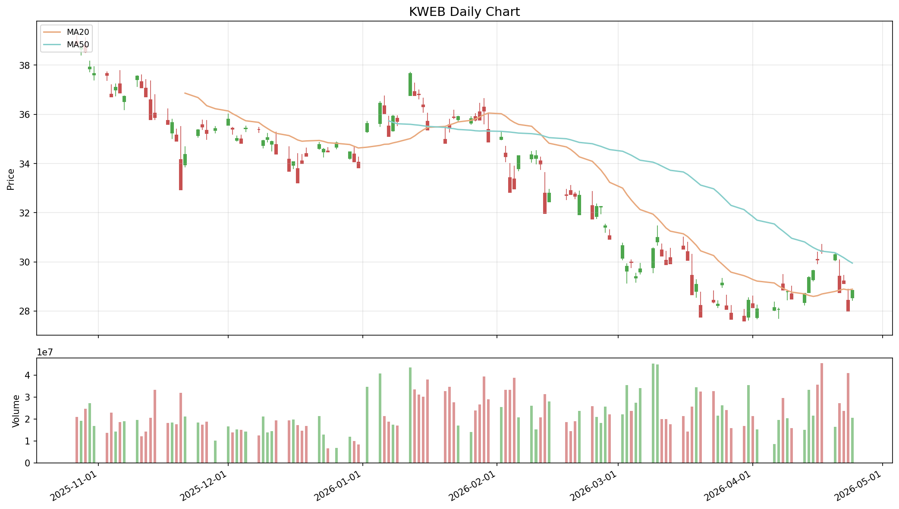

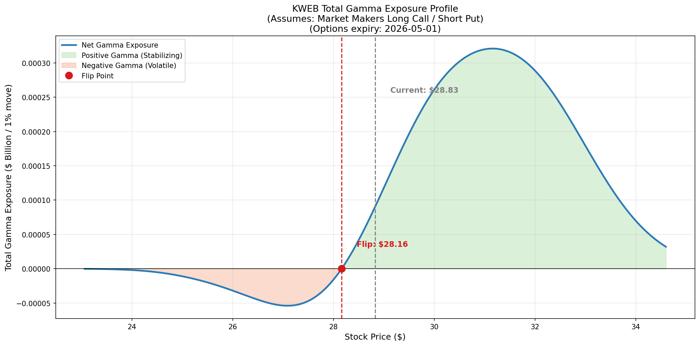

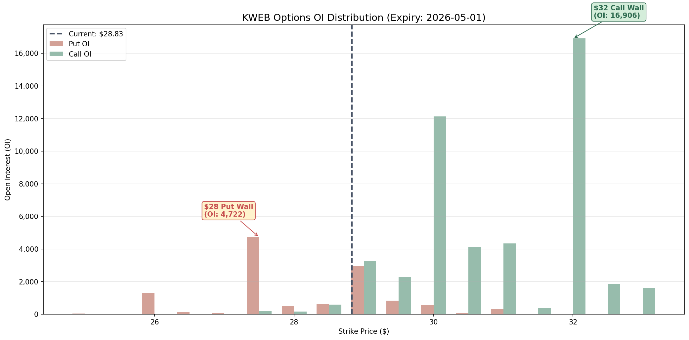

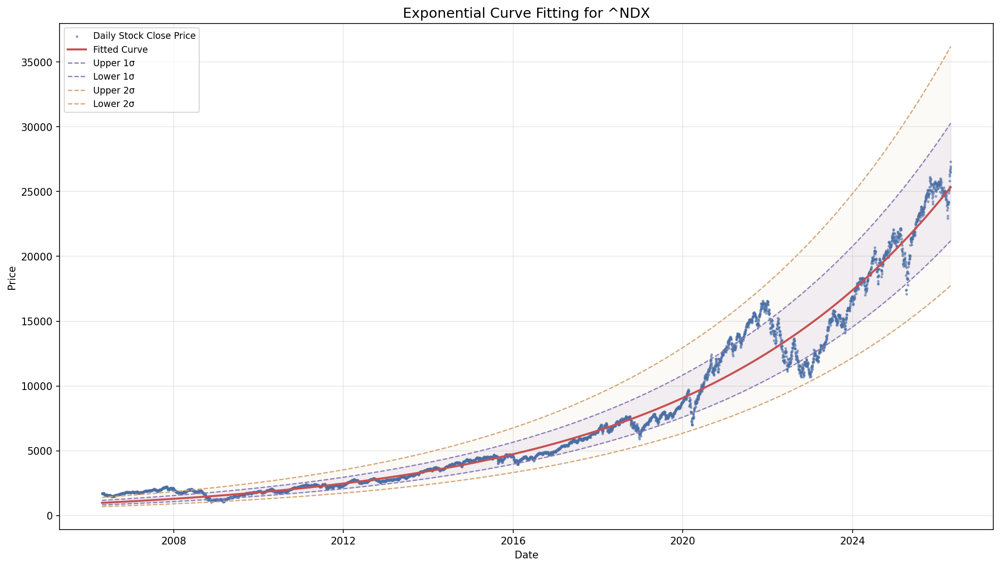

