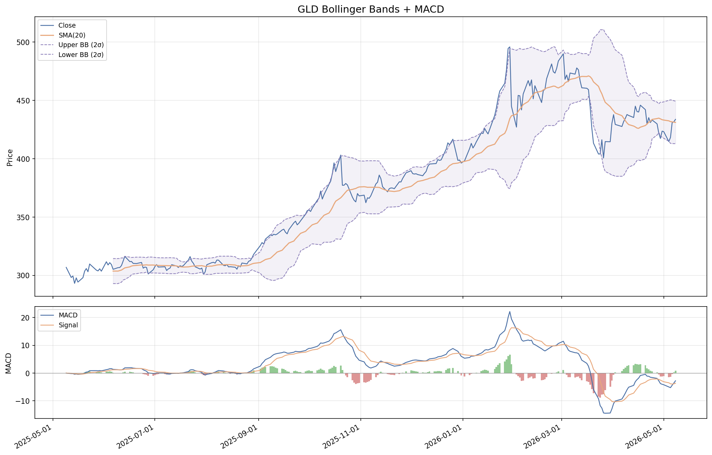
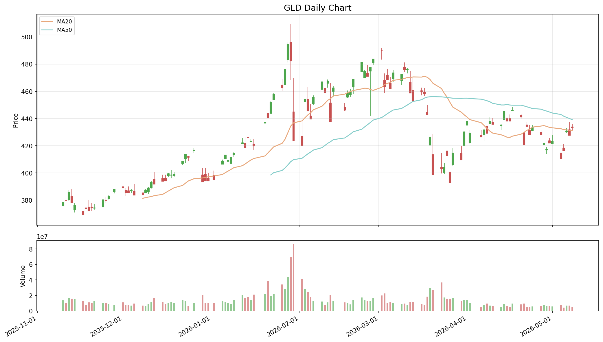
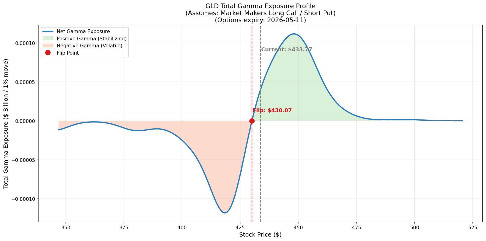
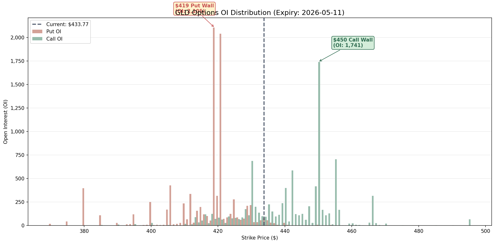
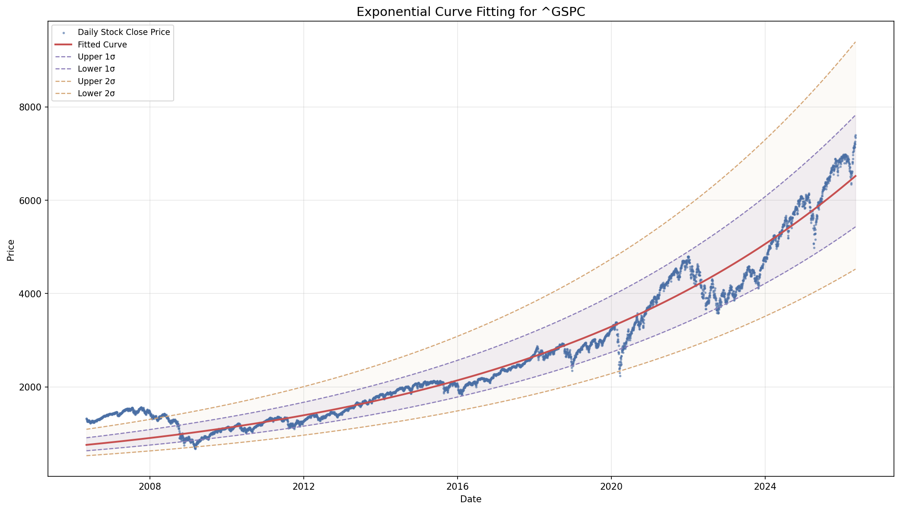
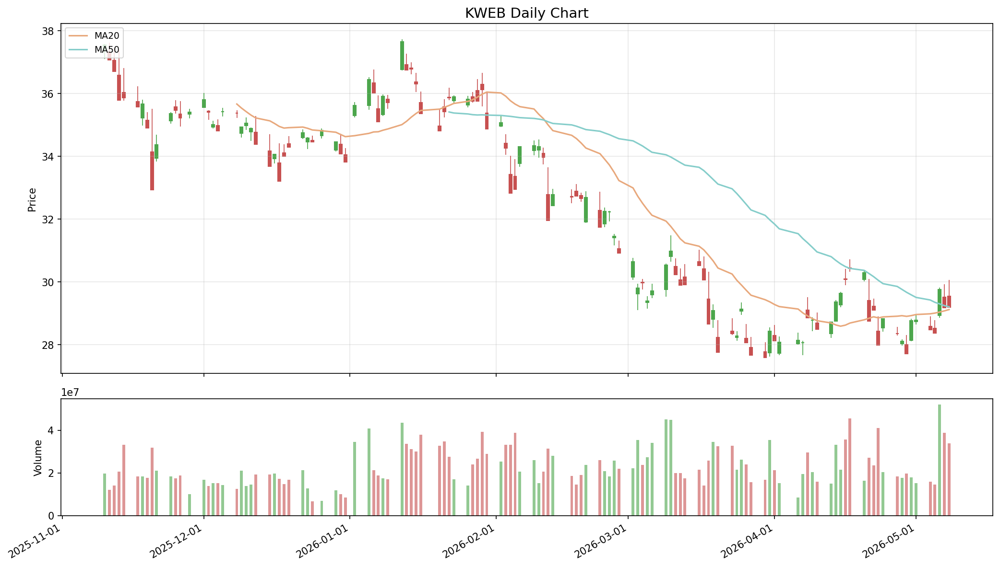
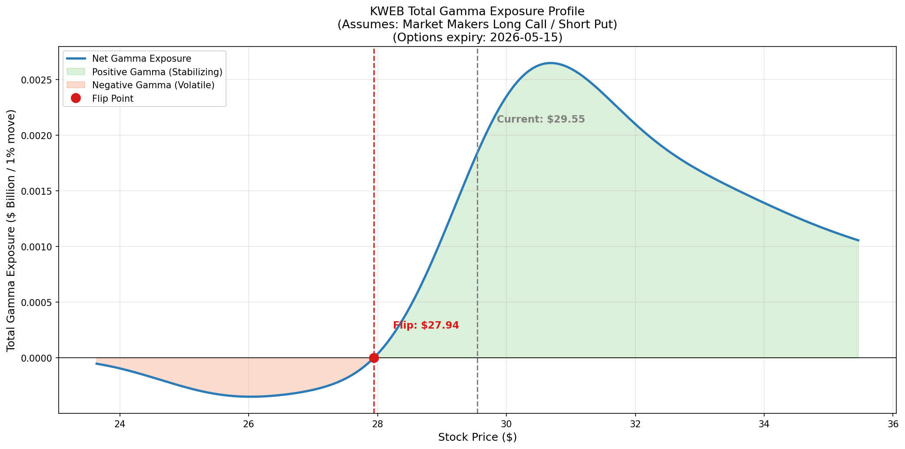
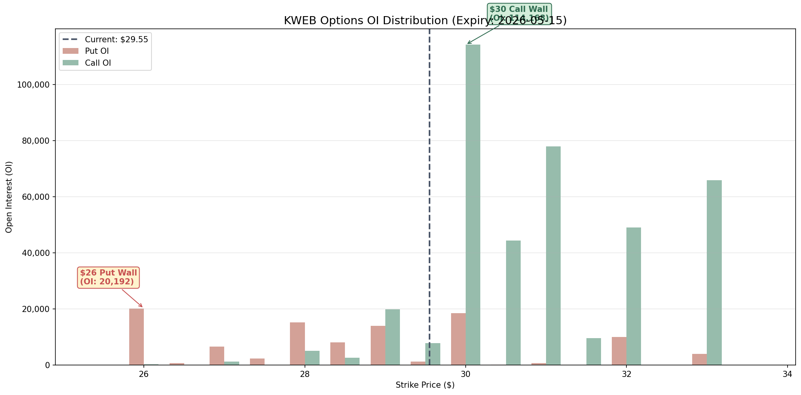
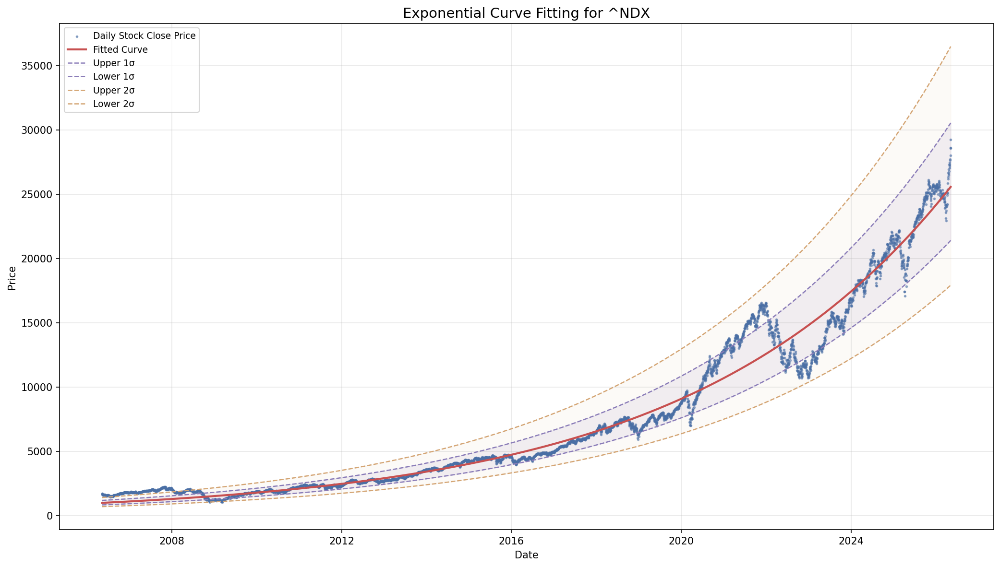

# Quant Juicer Daily Report (2026-05-10 21:02)

## Price Alerts

共 5 条预警：

| 品种 | 类型 | 当前价 | 关键位 | 说明 |
|------|------|--------|--------|------|
| 黄金 (GLD) | MA20 | 433.77 | 431.18 | 黄金 (GLD) 当前价 433.77 接近 MA20 (431.18) |
| 黄金 (GLD) | MA50 | 433.77 | 439.13 | 黄金 (GLD) 当前价 433.77 接近 MA50 (439.13) |
| 中概互联 (KWEB) | MA20 | 29.55 | 29.12 | 中概互联 (KWEB) 当前价 29.55 接近 MA20 (29.12) |
| 中概互联 (KWEB) | MA50 | 29.55 | 29.21 | 中概互联 (KWEB) 当前价 29.55 接近 MA50 (29.21) |
| 纳指 (^NDX) | daily_move | 29234.99 | +2.4% | 纳指 (^NDX) 大涨 2.3% (当前 29234.99) |

## Weibo Updates

新增 5 条帖子

## Chart Key Findings

- [黄金 (GLD)] Put Wall: $419 (OI: 2,105) — support
- [黄金 (GLD)] Call Wall: $450 (OI: 1,741) — resistance
- [黄金 (GLD)] Flip Point: $430.07
- [黄金 (GLD)] -> Price ABOVE flip: positive gamma environment (stabilizing)
- [黄金 (GLD)] BB %B: 57.1% (0=lower, 100=upper)
- [黄金 (GLD)] -> MACD above signal: bullish
- [中概互联 (KWEB)] Put Wall: $26 (OI: 20,192) — support
- [中概互联 (KWEB)] Call Wall: $30 (OI: 114,168) — resistance
- [中概互联 (KWEB)] Flip Point: $27.94
- [中概互联 (KWEB)] -> Price ABOVE flip: positive gamma environment (stabilizing)
- [纳指 (^NDX)] Z-Score: 0.75
- [纳指 (^NDX)] -> Price is within 1 sigma (fairly valued)
- [标普 (^GSPC)] Z-Score: 0.69
- [标普 (^GSPC)] -> Price is within 1 sigma (fairly valued)

## Charts Generated

成功: 9, 失败: 2

