量化投资榨汁机

https://weibo.com/u/6937480224

2026-03-17 恒生科技 创新药 纳指

原文

除了关注港股/恒科的底部外，另外一边也要关注A股市场风格切换是否确认，注意到最近国债跌的很猛，吃掉了之前的反弹，在国债利率明显抬升的情况下，部分红利股依然坚挺，显然是有部分资金在主动买入“老登”资产，当然风格切换与否仍主要取决于AI为首的小登资产的泡沫化程度。此外，我观察到的是，部分小微盘垃圾股筹码已经有松动的迹象了。总之，我仍然坚持年初的观点，要注意新兴资产的泡沫进展，机会可能出现在去年大幅跑输的红利股（中小公用事业）、连续多年被市场抛弃的消费股（必要消费）、高位调整充分的创新药械（优质头部或特色中小）、少部分优质制造业（全球隐形冠军）等版块上。

评论

回复@RebeBaby:也不光是中概和纳指。比方说红利就可以宽松一些 像消费啊医药啊环保啊 甚至包括A股大盘（A50，CSI300等等）本身 这些就要很严格。总体来说 一方面看历史数据回撤之后能否快速反弹 另一方面 看你要买的这东西能不能给你一种“再跌也不要紧 反正早晚能涨回来”的信念感 #今日看盘#//@RebeBaby:博主是意思是中概严格一些，纳指宽松一些吗？//@量化投资榨汁机:回复@三色石-:说得很好。具体一点的话 一些品种我会要求宽松一点 只要合理偏低的估值就可以买；一些品种我会要求严格一些 必须低估+明确启动信号才买 防止低位被硬套//@三色石-:越来越觉得，一切都是有周期的，在底部或低估的时候陆续买入并持有就行了，没有机会就等，等不到就算了

回复@由然冯雅:感谢信任 对于这种底部明确、等待向上突破信号的情况 推荐的操作手法是先开着定投 等到信号出现就全额买入 这有助于信号出现前拉低买入成本。比如说你打算买一万块钱的 可以每天定投三百 等到向上突破信号出现了（我到时候会提示大家） 再把剩余的钱一笔买入。基金//@由然冯雅:等你吹号，我再建仓

2026-03-17 恒生科技

原文

基金 📈周一，#恒生科技#和#中概互联#久旱逢甘霖 难得扬眉吐气了一把我们上周利用美股中概互联指数ETF（KWEB）的期权链数据 已经明确推算出了恒科和中概互联的底部位置网页链接。周一的走势算是逻辑的初步兑现。接下来我们看看最新数据显示的结果 给大家提提醒：1️⃣ 看交易量：周一的反弹并未伴随着显著的交易量增加。大规模的增量援军（例如江湖传言中海湾国家王爷们的资金）尚未真正到场。2️⃣ 看期权链：本周五是本月最大的期权到期日 根据期权分布（图1），KWEB 在 32 处堆积了非常强的 Call 墙，而在 31 处则有一道坚硬的 Put 墙。这两道“墙”形成了一个极其狭小的价格博弈区间，将价格死死地“夹”在了中间。因此，我判断截止到本周末，中概互联和恒科的价格大概率会在这上下 3% 的狭小范围内震荡打磨，向上和向下的突破都很困难。📈对大家的几点建议：- 有仓位的朋友：安心拿好即可。- 想补仓的朋友：因为底部已明确 在这个位置进行定投或者阶梯状补仓是个不太坏的选择。💡最后严正提醒：切忌在此处梭哈；底部的确认和趋势的右侧反转是两回事，真正的大机会需要等待资金流向的质变，时候还未到。

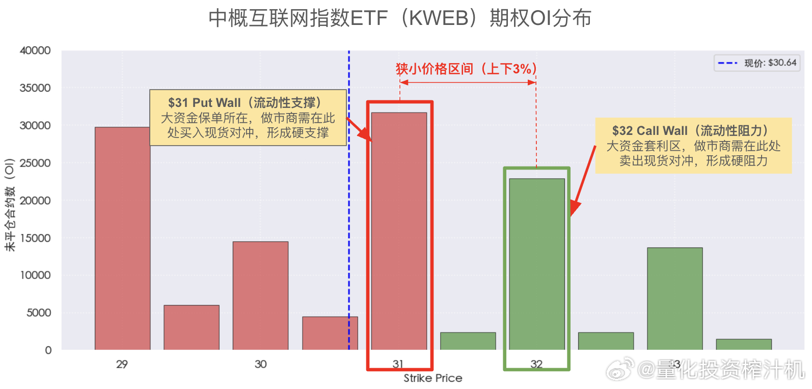

2026-03-15 纳指

原文

基金 本周五纳斯达克100指数收于24380.73，从去年九月到今天，整整横盘6个月了。经过这段漫长的横盘调整 纳斯达克100指数终于再次触碰到了长期趋势线。我们一直说 再好的资产标的也不要fomo 世界上不存在无脑定投就能赚钱的东西（然后看着某些在纳指高点高喊着定投纳指永远不亏甚至要借钱上杠杆的博主到处上蹿下跳 真是头疼）。经过这段盘整 无脑定投的声音总算消停了 纳指价格反倒渐趋合理了国内投资者购买纳指基金有个问题：场内etf溢价经常过高 场外基金又限购 很难在真正低点大笔梭哈 所以在价格合理区开始定投是个不太坏的选择。上午发了各个纳指100基金的费率和限额网页链接（有机智的朋友已经猜到了用意） 供大家参考 提醒一句：综合各项费率在1%以上的基金就不要考虑了 不要给黑心基金经理送钱。最后友情提示：现在的价格只是趋于合理 还没到显著低估的程度 请各位根据自己的资金情况酌情考虑买入安排 暂时没有心急火燎全部拉满的必要。如果未来出现真正的黄金坑好机会 我会提醒大家。#美股##纳指#

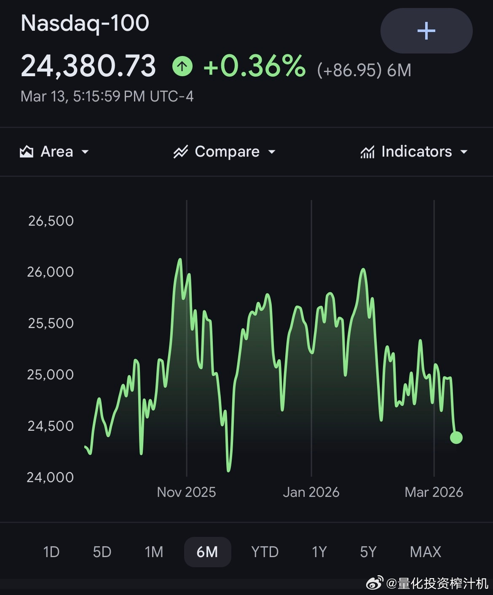

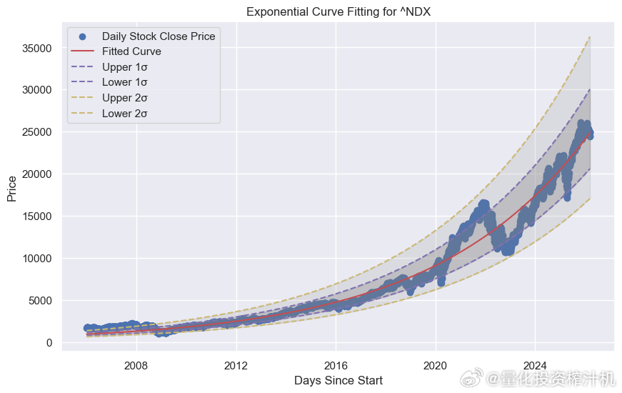

评论

回复@三色石-:说得很好。具体一点的话 一些品种我会要求宽松一点 只要合理偏低的估值就可以买；一些品种我会要求严格一些 必须低估+明确启动信号才买 防止低位被硬套//@三色石-:越来越觉得，一切都是有周期的，在底部或低估的时候陆续买入并持有就行了，没有机会就等，等不到就算了

2026-03-15 纳指

原文

基金 一图流：给大家整理好了全部纳斯达克100指数基金（A类）的信息，包括基金代码、费率、每日买入限额。表中按基金费率从低到高排列。这应该是全网独一份了 建议各位直接收藏#美股##纳指#

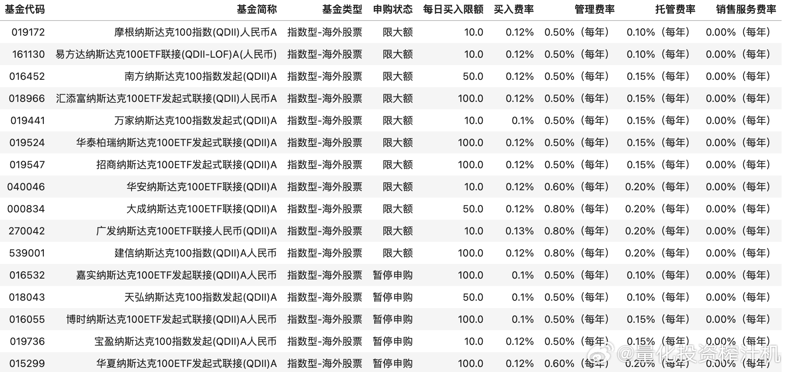

2026-03-15 综合

原文

周一，抄不抄？

2026-03-14 原油

原文

关于油价的热搜真是一会一变 #原油直线大跳水##美元原油大幅拉升#🚀发个“暴论”：如果我是伊朗，我绝不会死掐着霍尔木兹海峡不放让油价单边暴涨，而是会选择“掐一阵子、松一下、再掐上”，让油价整体处于高位的情况下隔三差五冷不丁跌上一记。为啥要这样反复横跳？因为这样才构成对美国经济和金融最精准的打击。长期高油价固然能杀伤美国经济，但如果油价始终死撑在高位，那就是在给美国的页岩油商送“大礼包”。页岩油盈亏线在60美元附近，一旦他们预期油价会长期处于高位，页岩油会立马大规模入场，这不但会平抑油价，还会变相巩固美国的石油霸权。这跟伊朗的目标简直背道而驰。💰如何拿捏住页岩油商呢？页岩油商的扩产计划需要华尔街和董事会的点头，为此，他们需要油价“长期稳定在80美元（成本+资本溢价）以上”的预期。所以，只要伊朗搞断续式干扰，让油价在短期内冲高拉动通胀，然后冷不丁回撤一下跌破80。有这个不确定性在，页岩油商看着上下横跳的油价就只能干瞪眼，美国也就只能硬扛高油价的伤害。⛽️基于以上逻辑，油价在未来一段时间大概率会在80-100之间大幅震荡，而不是单边暴涨。（当然，这里有个变量：伊朗决策层是否足够理性？我个人愿意赌一下：在存亡攸关的博弈面前，决策者会自发向这种“最优策略”靠拢。）💡对大家操作的建议：第一，不要在油价高位追涨；第二，等待油价跌向80附近，这里会有做波段的机会。

2026-03-14 原油

原文

对于石油大涨对各国的影响，我看了好几篇研究，有从消费占比角度切入，说美国消费占GDP比重很高，石油大涨会带动商品涨价，压制消费，因此对美国GDP影响最大，相对于的消费占比小的国家影响就小（如东国），也有从能源供给角度的分析的，当然看的不仅是石油产量，也包括其他如煤、光、风、核等能源，从总的能源需求缺口来看，日韩是影响最大的，而美国是能源净出口国，影响反而没那么大。我觉得就像看一个公司的财报，不能只看利润表，更要看资产负债表，除了这些角度，也要思考通胀如果上升，对哪些国家的资产负债表影响大，比如美国目前利率在高位，但有强烈需求要利率下去，所以前提当然是通胀不能大幅反弹，美联储还是有一定独立性的，另外，某国也需要利率维持在低位，因为实体的情况无法承受利率升高带来的偿债压力。

2026-03-11 恒生科技 中概互联 美股

原文

基金 这两天中概互联和恒科稍有了点起色。很多重仓的朋友已经煎熬了很久，迫切盼望春天的到来#中概股集体高开#。正好，美股有一只中概互联网指数ETF（KWEB），大A这几只基金（交银中互、易方达中概、恒科ETF等）的权重股和走势与其高度挂钩。另外这几只基金走势本身也高度相关（图1）。我们可以利用KWEB这边更完善的期权链数据，来分析上述中概互联和恒科基金的走势。关于如何从期权链判断支撑位/反转点，我们以前详细写过网页链接，今天不多废话，直接看根据最新数据（图2、图3）得出的几个关键点位：- 【结构性底部】各基金当前价格下方约4.5%的位置（对应KWEB在29.65处的GEX Minimal）。在此位置下方，空头的力量渐趋衰竭。- 【底部二级支撑】各基金当前价格下方约6.5%的位置（对应KWEB在29处的期权墙）。此处堆积了大量期权提供的买入流动性，构成强力支撑。- 【压力位/右侧买点】各基金当前价格上方约2.2%的位置（对应KWEB在$31.71处的Gamma反转点）。站稳该位置，机构将转为多头助攻。💡综上述，如果你是左侧交易者，在当前位置下行风险有限；如果你是右侧交易者，可以等到现价站稳上方2%处的趋势反转点则更为稳妥。祝各位能守得云开见月明。

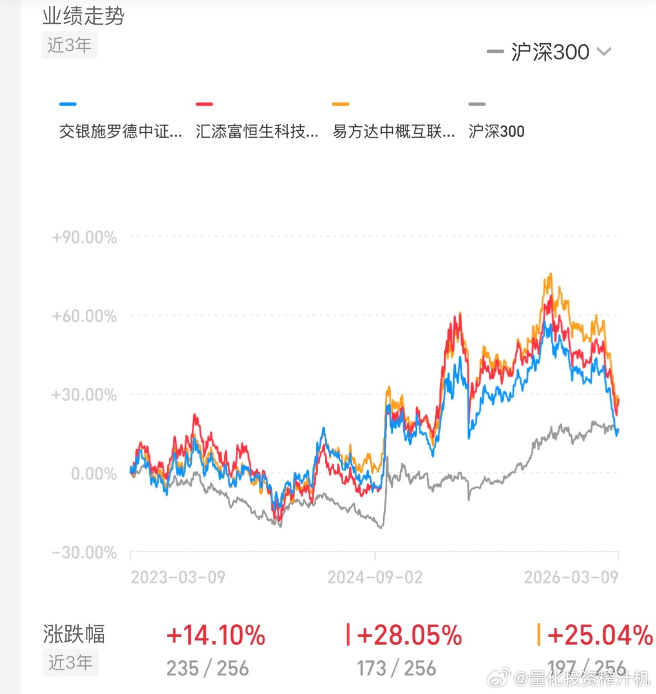

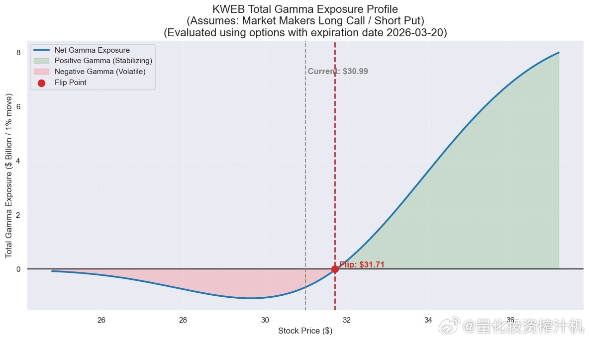

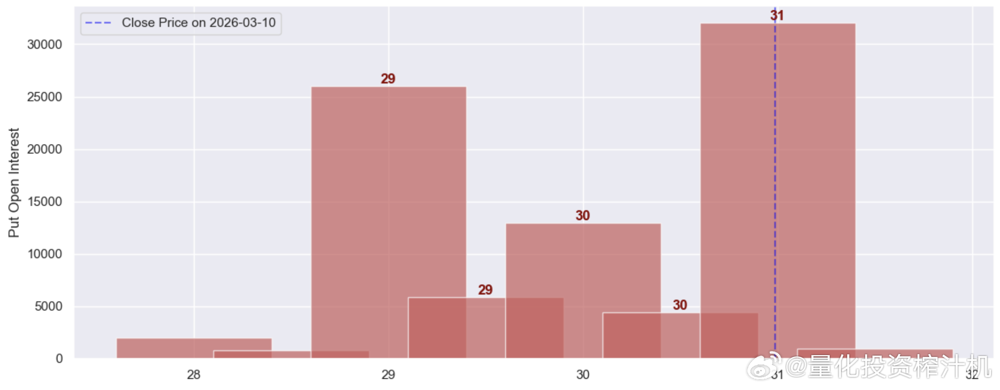

2026-03-10 原油

原文

基金 天天讲伊朗局势 我都快转型时政博主了刚刚说过网页链接这次冲突因为懂王的因素不会长期化 才过了几个小时 还真就来了#特朗普称战争已基本结束#。#油价# 随之大幅回调 抹去日内最大30%的涨幅。有句讲句 很多人对伊朗感情投射过深了 可能是把伊朗革命卫队当成了抗战中的八路军？实际上 它充其量就是个北洋军阀；须知当年张作霖被日本人炸死了，也没见张学良跟小鬼子拼命啊。你现在哀其不幸 一回头 搞不好伊朗又和美国哥俩好上了 你又要怒其不争 白白让自己情绪内耗 何必呢⛽️最后关于油价：随着局势降温 原油价格短期内看空（但切忌做空 ）；而中期看 油价肯定不会回到本次冲突之前50多的低位了，70多这个位置应该会成为新的定价中枢。在这个区间我觉得可以拿个小仓位波段操作一下 局势平稳了就买点 动荡加剧了就卖。

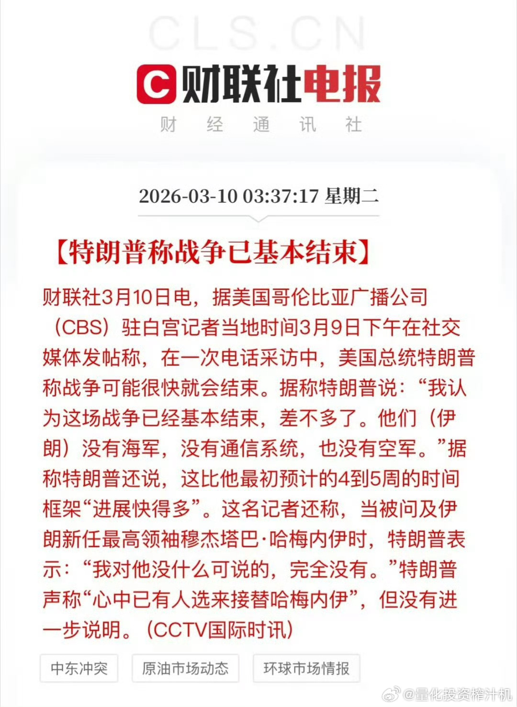

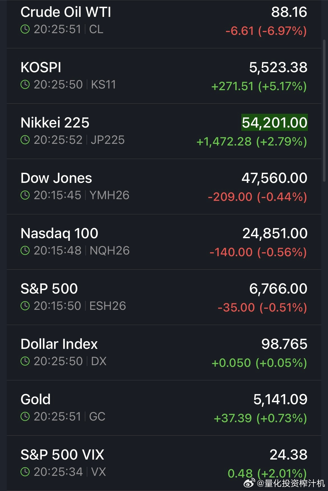

2026-03-09 美股 原油

原文

基金 昨夜市场坐了一回过山车。原油涨幅从惊人的30%回落至13%附近#油价涨爆了##石油直线跳水#；恐慌指数（VIX）由13%收窄至3%；美股三大股指期货盘前跌幅收窄至1%左右。亚太这边，日韩股指均遭重创，我们大A相较而言反倒坚挺了一把。昨晚提到的流动性危机有所缓解网页链接。不过有些朋友担忧这场由国际局势冲突引发的危机会不会长期化，我的判断是可能性有限，理由有三：第一，懂王本人的因素，这点就不多说了第二，不宜高估伊朗的抵抗意志。从感性上，我和很多人一样，同情伊朗普通人民遭受的战争创伤，希望战争狂人们被彻底清算；但在理性上，伊朗的各个军头们并没有太多维持战争长期化的动力，目前的剧烈摩擦更像是为后续谈判增加筹码。建议各位不要感情投射过深，陷入“哀其不幸，怒其不争”的情绪反复，只会徒增内耗。第三，不宜低估东大的战略定力。和平与发展是东大在当前国际局势下的煌煌王道，高油价并不符合东大的经济利益，东大要的是堂堂正正的国际竞争，绝不屑于冒着弄脏衣服的风险去踩泥潭里的对手几脚。战略上的清醒，决定了东大不会轻易卷入“杀敌一千 自损八百”的乱局。回到经济本身。本次危机会带来一些长远后果：油价的定价中枢肯定会上移（别的不论，油轮保费肯定要涨），但整体上，我们维持之前的判断——此次波动对全球经济基本面的冲击有限，引发恶性通胀的可能性极低。还是那句话：稳住，我们能赢。

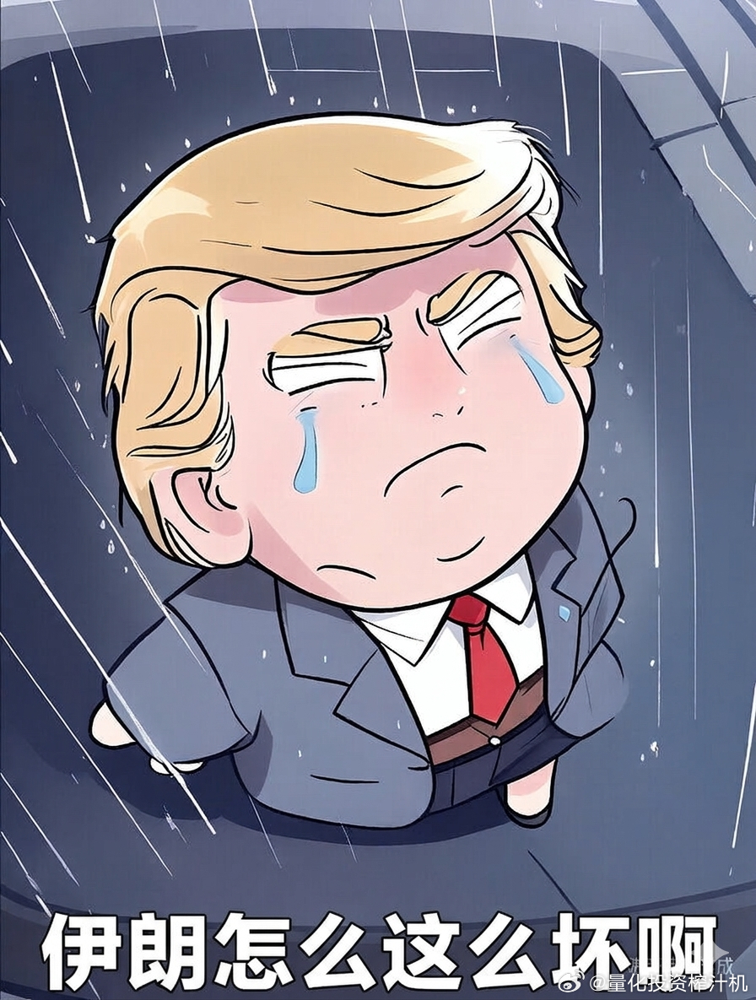

2026-03-09 纳指 美股 黄金

原文

基金 🛢️原油价格狂飙+20%。与此同时，全球股市和大宗商品正遭血洗：📉 韩国股指KOSPI跌8%📉 日经Nikkei225跌近7%📉 美股期指重挫（道指、纳指、标普500期货均跌约 2%）📉 黄金 跌 1.4%📉 白银 跌 4.2%一片哀鸿遍野中，唯二涨的：💵 美元指数微涨0.65%📈 恐慌指数VIX暴涨11%💡当前市场整体处于恐慌状态。各大资产价格暴跌，本质上是流动性挤兑的结果：机构被迫抛售一切资产换取美元来补充交易保证金（故而美元微涨）。提醒各位两点：1️⃣不要着急接飞刀——市场的情绪底在哪里还没有摸清，现在抄左侧底容易遭二次重创。2️⃣更不要恐慌性割肉——既然是流动性杀跌的局面，优质资产在流动性恢复后往往会迎来价值的快速修复。💡恐慌情绪出现时，人们总是想做点什么来缓解焦虑。其实，这时候不盲目操作，就已经打败了市场上绝大多数的玩家。💪🏻交易即战场。各位指挥官，守好你的仓位，拿出“总预备队，不动”的气势来。

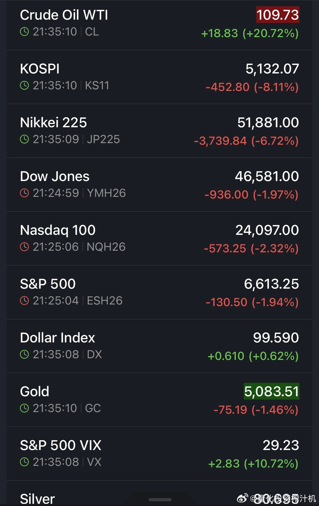

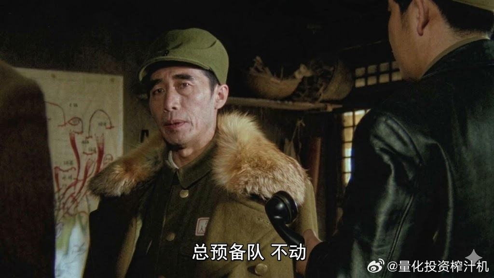

评论

回复@这也太那个:如果你能搞清楚一个东西到底值多少钱 做价值投资 那是不用止损的。但如果只是看起来便宜 或者技术面上有信号 那就要记牢“永远没有100%精确的信号” 总是会有false positive出现 所以进场之前就要想好退出机制。关于止损 改天我详细写一下吧（正好我消费也被套了 现成的例子）//@这也太那个:真啥不得割肉。如果把药看成消费品，那就熬到周期轮回的那一天

回复@三色石-:价值投资的核心是能否计算（哪怕是粗略估算）出一家公司未来能赚多少钱 有了结果 跟现价一比较 就能作为投资依据了。红利/自由现金流是好标的 不是说它不会高估 是说它任何时候都比较好算。其它标的往往只在特定市场环境下能计算 环境一变就算不出了。今年的话 化工和工程算是处在“可计算环境”里。//@三色石-:请教，哪类股票才可以成为价值投资的标的呢？红利股？
